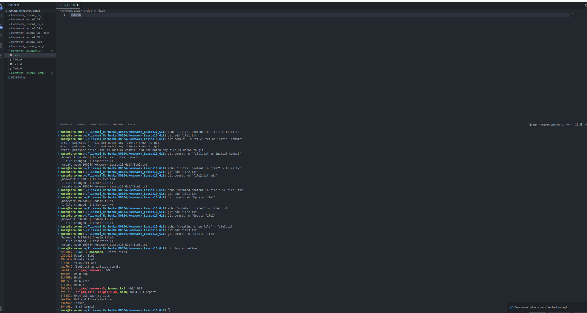
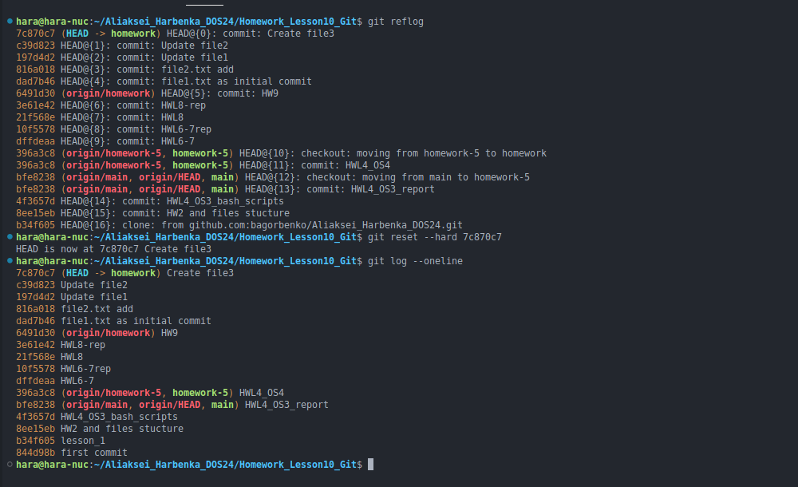
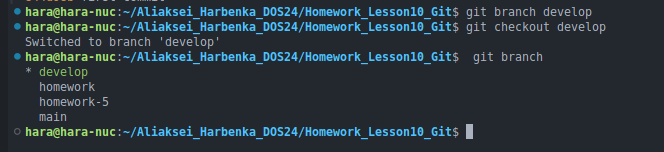
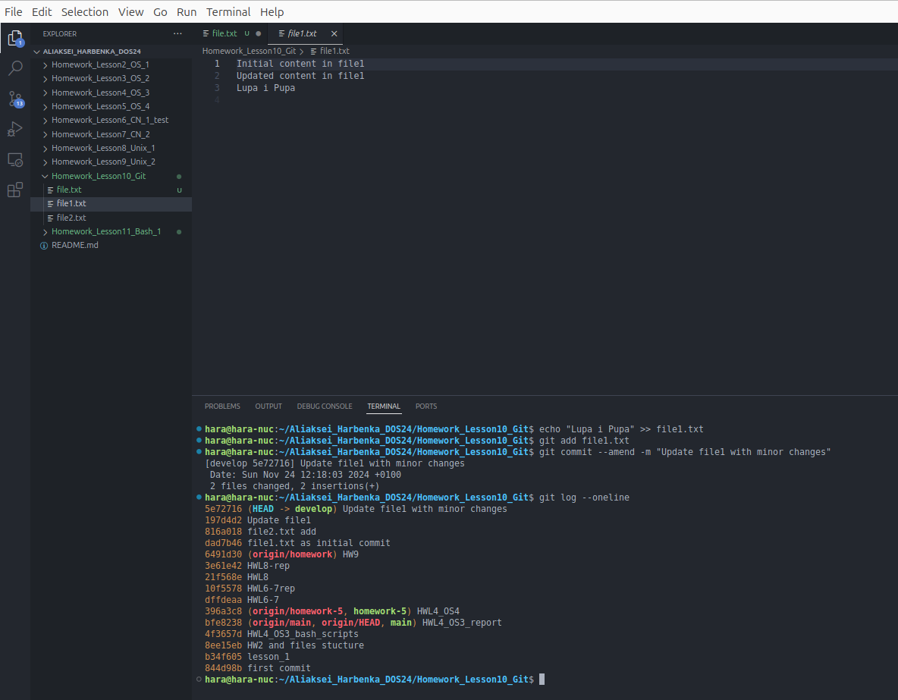
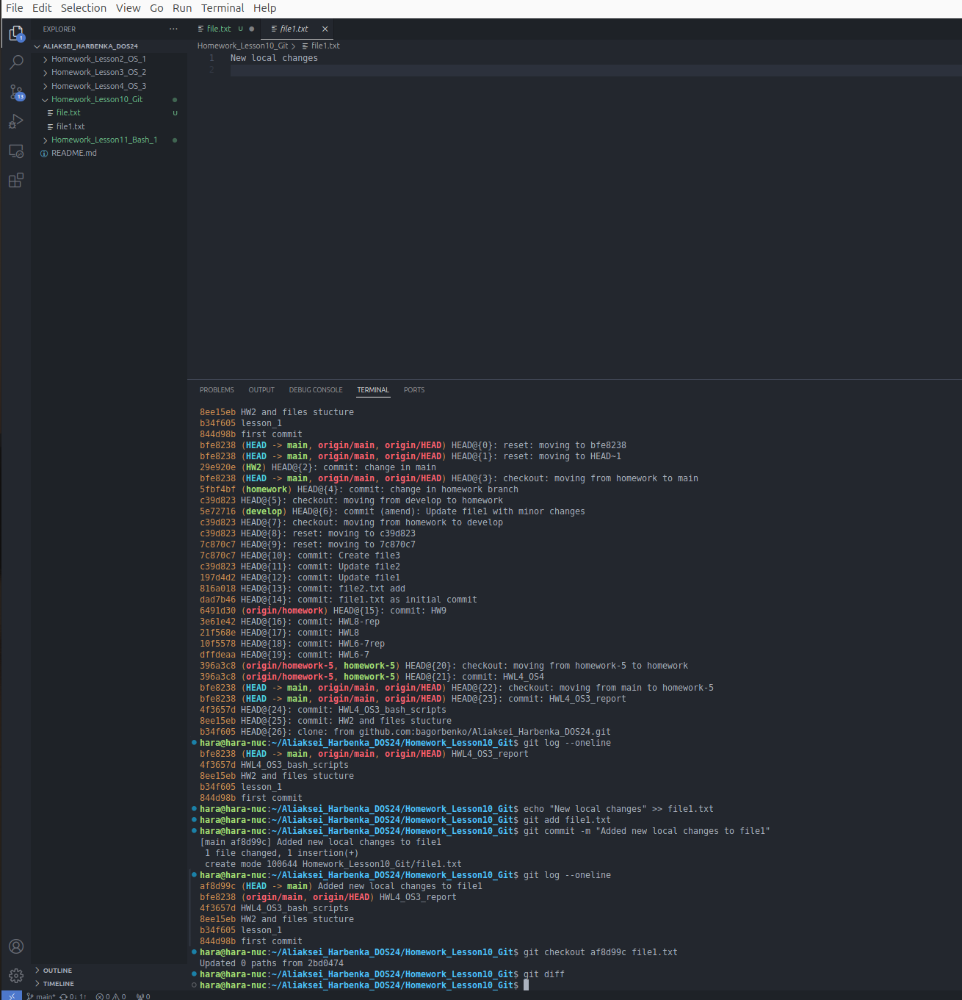
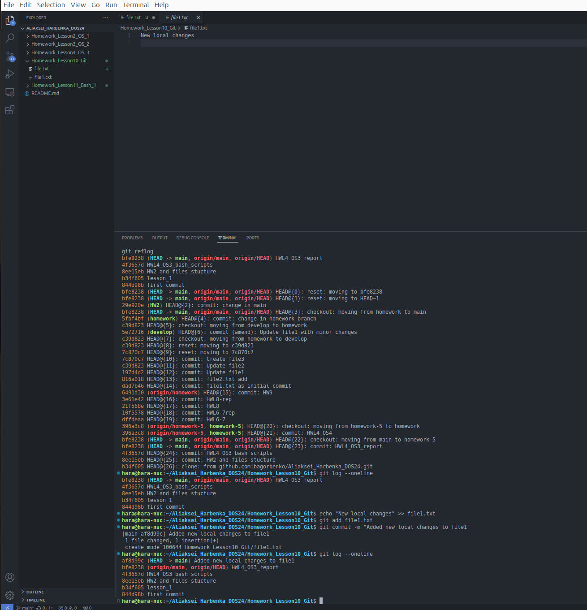
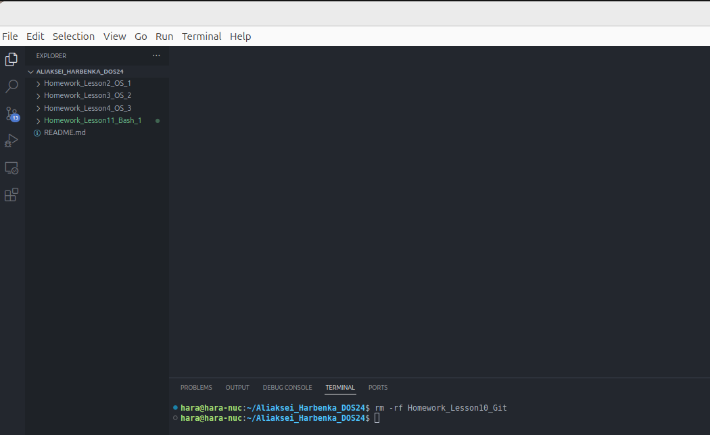

# Отчет по выполнению задания TMS_HomeWork

## Индивидуальная часть

### Шаг 1: Создание 5-10 коммитов
1. Созданы файлы и внесены изменения:
   - `file1.txt`: добавлено содержимое 
   - `file2.txt`: добавлено содержимое
   - `file3.txt`: создан новый файл.
2. Лог коммитов:
   ```
   7c870c7 (HEAD -> homework) Create file3
   c39d823 Update file2
   197dd42 Update file1
   da07d46 file1.txt as initial commit
   ```
3. Скриншот подтверждения:
   - 

---

### Шаг 2: Переход к предыдущему коммиту с помощью reflog
1. Использована команда `git reflog` для просмотра истории:
   ```
   HEAD@{0}: reset: moving to HEAD~1
   HEAD@{1}: commit: Create file3
   HEAD@{2}: commit: Update file2
   ```
2. Выполнен переход на предыдущий коммит:
   ```bash
   git reset --hard c39d823
   ```
3. Лог после перехода:
   ```
   c39d823 Update file2
   197dd42 Update file1
   da07d46 file1.txt as initial commit
   ```
4. Скриншот подтверждения:
   - 

---

### Шаг 3: Создание ветки
1. Создана ветка `develop`:
   ```bash
   git branch develop
   ```
2. Переключение на ветку:
   ```bash
   git checkout develop
   ```
3. Скриншот подтверждения:
   - 

---

### Шаг 4: Коммит с помощью `--amend`
1. Внесены небольшие изменения в файл:
   ```bash
   echo "Lupa i Pupa" >> file1.txt
   git add file1.txt
   git commit --amend -m "Updated file1 with minor changes"
   ```
2. Скриншот подтверждения:
- 

---

### Шаг 5: Изменение в main без push
1. Сделаны изменения в ветке `main`:
   ```bash
   echo "Main branch changes" >> main-file.txt
   git add main-file.txt
   git commit -m "Change in main"
   ```

### Шаг 6: Перемещение изменений в новую ветку
1. Создана ветка `HW2` для сохранения изменений:
   ```bash
   git branch HW2
   ```
2. Откат ветки `main`:
   ```bash
   git reset --hard HEAD~1
   ```
3. Скриншот подтверждения:
    

---

### Шаг 7: Локальные изменения и коммит
1. Внесены локальные изменения в файл:
   ```bash
   echo "New local changes" >> file1.txt
   git add file1.txt
   git commit -m "Added new local changes to file1"
   ```
2. Скриншот подтвержден
 
---

### Шаг 8: Откат изменений через checkout
1. Файл `file1.txt` откатился к коммиту `abf699c`:
   ```bash
   git checkout abf699c file1.txt
   ```
2. Проверено состояние:
   ```bash
   git diff
   ```
3. Скриншот подтверждения:
 

 
---

## Итог
Задание выполнено успешно. Все шаги выполнены корректно. Логи и скриншоты приложены в соответствующих местах.