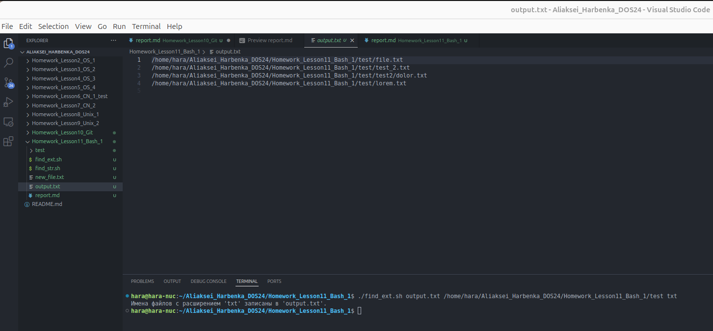

# Отчет по выполнению задания на Bash-скрипты

## Задание 1: Скрипт для поиска файлов с заданным расширением

### Описание
Скрипт `find_ext.sh` выполняет поиск всех файлов с указанным расширением в заданном каталоге (с глубиной поиска 3) и записывает их имена в указанный файл.

### Пример выполнения
Команда запуска скрипта:
```bash
./find_ext.sh output.txt /home/hara/Aliaksei_Harbenka_DOS24/Homework_Lesson11_Bash_1/test txt
```

Результат выполнения:
- Все файлы с расширением `.txt`, находящиеся в каталоге `/home/hara/Aliaksei_Harbenka_DOS24/Homework_Lesson11_Bash_1/test`, записаны в файл `output.txt`.

**Результат выполнения**:


---

## Задание 2: Скрипт для поиска строки в файлах

### Описание
Скрипт `find_str.sh` выполняет поиск указанной строки во всех файлах заданного каталога и его подкаталогов. Если строка найдена, выводится полное имя файла, имя файла, а также его размер. Скрипт обрабатывает ошибки доступа к каталогам и файлам.

### Пример выполнения
Команда запуска скрипта:
```bash
./find_str.sh "Lorem" /home/hara/Aliaksei_Harbenka_DOS24/Homework_Lesson11_Bash_1/test
```

Результат выполнения:
- Найдены все файлы, содержащие строку `Lorem`, их информация выведена в консоль.

### Скриншот
**Результат выполнения**:


---

## Выводы
1. Скрипты успешно реализованы и протестированы.
2. Скрипт `find_ext.sh` корректно обрабатывает файлы и записывает их в указанный файл.
3. Скрипт `find_str.sh` корректно ищет строки, выводит информацию о файлах.
4. Структура кода обеспечивает легкость модификации и масштабируемость.
