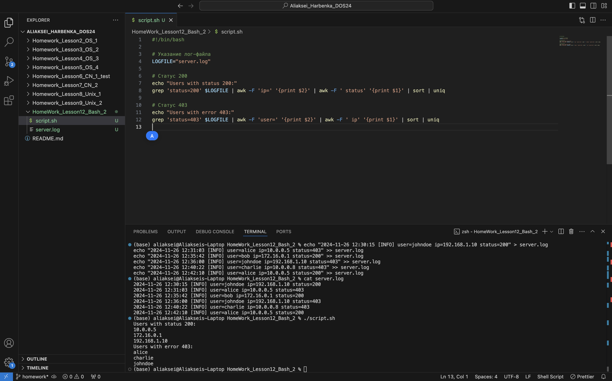

# Отчет по выполнению задания: Анализ логов сервера

## Описание задачи

Задача заключалась в извлечении информации из логов сервера. Необходимо было выполнить следующие действия:

1. Извлечь все IP-адреса, с которых произошел успешный вход (код ответа 200).
2. Извлечь всех уникальных пользователей, которые пытались авторизоваться, но получили ошибку (код ответа 403).

Для решения задачи был написан Bash-скрипт, который выполняет эти операции.

## Шаги выполнения

### 1. Генерация лог-файла

Для создания лог-файла использовалась команда `echo` в консоли, которая записывала строки логов в файл `server.log`. Пример записей в лог:

```
2024-11-26 12:30:15 [INFO] user=johndoe ip=192.168.1.10 status=200
2024-11-26 12:31:03 [INFO] user=alice ip=10.0.0.5 status=403
2024-11-26 12:35:42 [INFO] user=bob ip=172.16.0.1 status=200
2024-11-26 12:36:00 [INFO] user=johndoe ip=192.168.1.10 status=403
2024-11-26 12:40:22 [INFO] user=charlie ip=10.0.0.8 status=403
2024-11-26 12:42:10 [INFO] user=alice ip=10.0.0.5 status=200
```

### 2. Написание Bash-скрипта

Для извлечения данных из лог-файла был написан Bash-скрипт. Скрипт выполняет следующие операции:

1. Извлекает IP-адреса с кодом ответа 200 (успешные логины).
2. Извлекает уникальные имена пользователей с кодом ответа 403 (ошибки авторизации).




### 3. Пример вывода

При успешном выполнении скрипта выводятся следующие результаты:

```
Users with status 200:
10.0.0.5
172.16.0.1
192.168.1.10

Users with error 403:
alice
charlie
johndoe
```

## Заключение

В результате выполнения задания был успешно написан и протестирован Bash-скрипт для извлечения информации из лог-файла. Скрипт корректно извлекает уникальные IP-адреса с успешными логинами и имена пользователей, которые столкнулись с ошибками авторизации (код 403).

## Использованные инструменты

- **Bash** — для написания скрипта и обработки логов.
- **grep, awk, sort, uniq** — утилиты для извлечения и обработки данных в файле.
