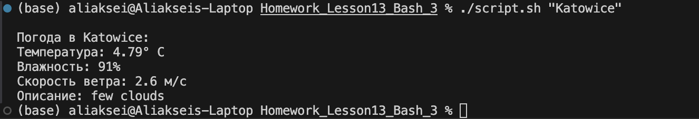

# Отчет по выполнению задания: Скрипт для получения данных о погоде с использованием OpenWeather API

## Описание задачи

Задача заключалась в создании скрипта для получения данных о текущей погоде с помощью OpenWeather API. Скрипт должен был:

1. Получить данные о погоде для указанного города.
2. Извлечь информацию о температуре, влажности, скорости ветра и описании погоды.
3. Вывести информацию в удобном формате.

## Шаги выполнения

### 1. Получение API ключа

Для работы с OpenWeather API зарегистрировались на [OpenWeather](https://openweathermap.org/) и получили API ключ. Этот ключ используется для выполнения запросов к сервису.

### 2. Создание конфига для безопасности

Cоздадим файл `config.env`, он должен будет строку с API ключом:

```
API_KEY=my_api_key
```

Также добавим файл config.env в .gitignore

### 3. Основные шаги в скрипте

1. **Получение данных с OpenWeather API**:
   Скрипт отправляет запрос к OpenWeather API с использованием переданного названия города и API ключа.

2. **Обработка данных**:
   Ответ от API обрабатывается с помощью утилиты `jq`, которая извлекает температуру, влажность, скорость ветра и описание погоды.

3. **Вывод информации**:
   Скрипт выводит информацию о погоде в следующем формате:

```
Погода в <город>:
Температура: <температура>°C
Влажность: <влажность>%
Скорость ветра: <скорость ветра> м/с
Описание: <описание>
```


## Заключение

В результате выполнения задания был создан рабочий Bash-скрипт, который позволяет получать актуальные данные о погоде для любого города с помощью OpenWeather API.
