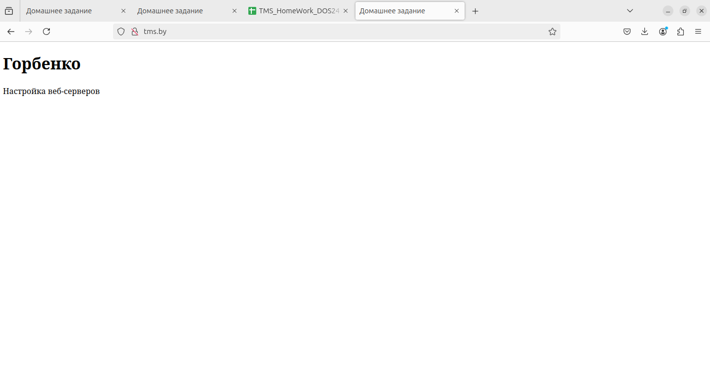
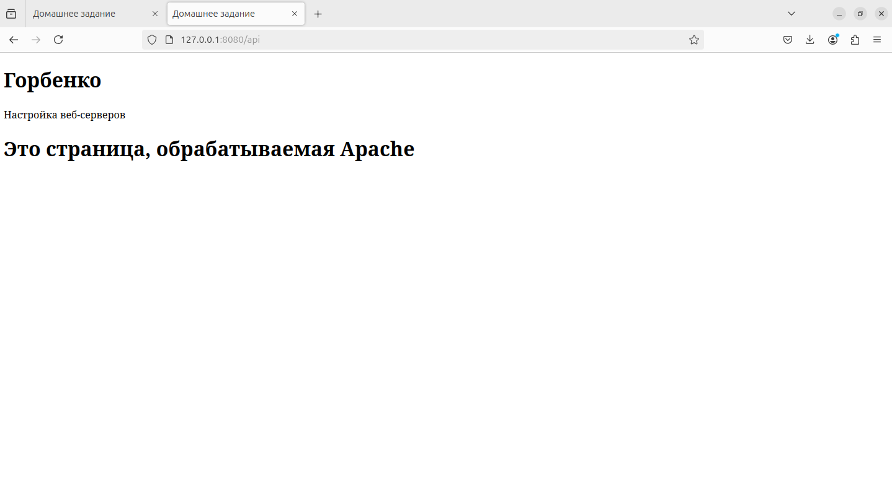
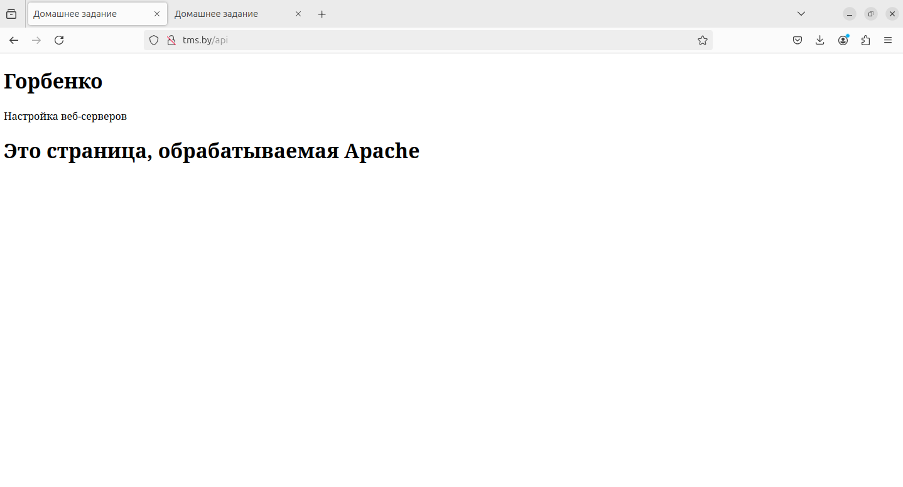

# Отчет по настройке веб-серверов Nginx и Apache

## Задание 1: Настройка Nginx

### Выполненные шаги:
1. Установлен и настроен веб-сервер Nginx.
2. Создана HTML-страница с содержанием:
   - Фамилия: Горбенко.
   - Тема: Настройка веб-серверов.
3. Настроен виртуальный хост для Nginx:
   - Файл конфигурации `/etc/nginx/sites-available/tms.by`:
     ```nginx
     server {
         listen 80;
         server_name tms.by;

         root /home/hara/Aliaksei_Harbenka_DOS24/Homework_Lesson14_Web-Servers_1/tms.by;
         index index.html;

         location / {
             try_files $uri $uri/ =404;
         }
     }
     ```
   - Символическая ссылка в `/etc/nginx/sites-enabled/`.

4. Проверена работа Nginx по адресу `http://tms.by` с помощью изменения файла `/etc/hosts`:
   ```plaintext
   127.0.0.1 tms.by
   ```

5. HTML-страница отображается корректно.




---

## Задание 2: Настройка связки Nginx + Apache

### Выполненные шаги:
1. Установлен веб-сервер Apache.
2. Создана HTML-страница для Apache с содержанием:
   ```html
   <!DOCTYPE html>
   <html lang="ru">
   <head>
       <meta charset="UTF-8">
       <title>Apache</title>
   </head>
   <body>
       <h1>Горбенко</h1>
       <p>Настройка веб-серверов</p>
       <h1>Это страница, обрабатываемая Apache</h1>
   </body>
   </html>
   ```

3. Настроен виртуальный хост для Apache:
   - Файл конфигурации `/etc/apache2/sites-available/apache-site.conf`:
     ```apache
     <VirtualHost *:8080>
         DocumentRoot /home/hara/Aliaksei_Harbenka_DOS24/Homework_Lesson14_Web-Servers_1/apache-site

         <Directory /home/hara/Aliaksei_Harbenka_DOS24/Homework_Lesson14_Web-Servers_1/apache-site>
             Options Indexes FollowSymLinks Includes
             AllowOverride None
             Require all granted
         </Directory>

         ErrorLog ${APACHE_LOG_DIR}/apache-site-error.log
         CustomLog ${APACHE_LOG_DIR}/apache-site-access.log combined
     </VirtualHost>
     ```

4. Включены модули Apache:
   - `mod_include` для работы `<!--#echo var="REMOTE_ADDR" -->`.

5. Настроен Nginx как reverse proxy:
   - Проксирование в файле конфигурации `/etc/nginx/sites-available/tms.by`:
     ```nginx
     ...
         location /api {
            proxy_pass http://127.0.0.1:8080; # Проксирование на Apache
            proxy_set_header Host $host;
            proxy_set_header X-Real-IP $remote_addr;
            proxy_set_header X-Forwarded-For $proxy_add_x_forwarded_for;
            proxy_set_header X-Forwarded-Proto $scheme;
        }
     ...
     
     ```

   - Nginx перенаправляет запросы к Apache на порт `8080`.

6. Проверена связка:
   - Nginx принимает запросы на порт `80` и перенаправляет их на Apache.
   - Apache корректно отображает страницу с IP-адресом клиента.

---

## Логи проверки

### Проверка Nginx:
- Конфигурация:
  ```bash
  sudo nginx -t
  ```
  **Результат:** `syntax is ok`.

- Тестирование:
  ```bash
  curl http://tms.by/api
  ```
  **Результат:** HTML-страница отображается корректно.

### Проверка Apache:
- Конфигурация:
  ```bash
  sudo apache2ctl configtest
  ```
  **Результат:** `Syntax OK`.

- Тестирование:
  ```bash
  curl http://127.0.0.1:8080/api
  ```
  **Результат:** HTML-страница Apache отображается корректно.



---

## Итог
1. Nginx успешно настроен как основной веб-сервер.
2. Apache работает как сервер приложений, принимая запросы через Nginx.
