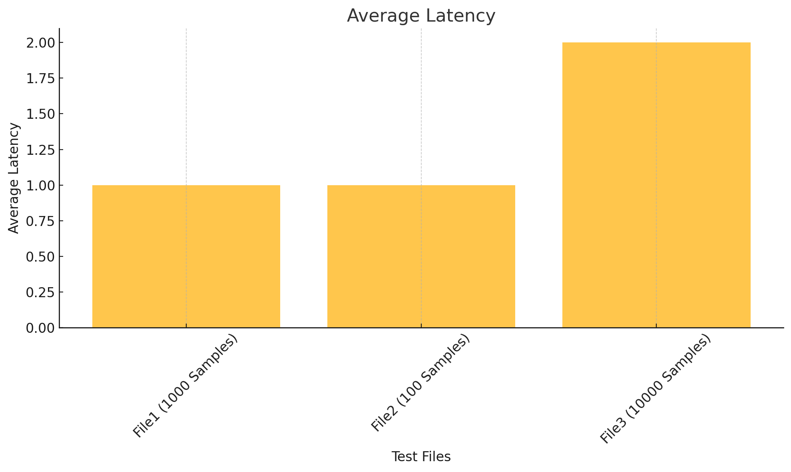
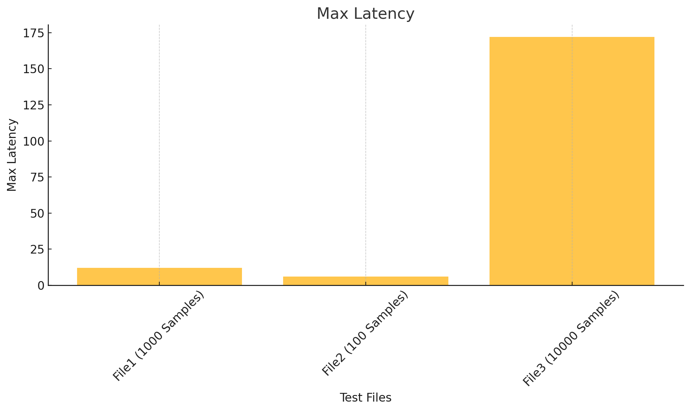
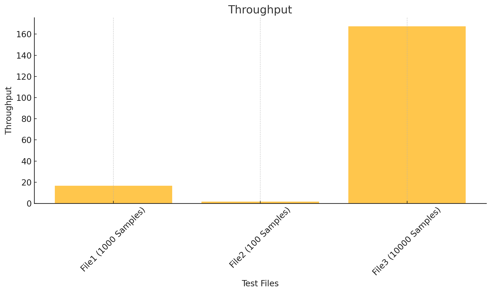
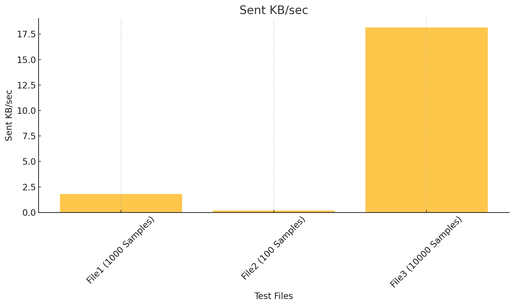

# Отчет о тестировании JMeter

Данный отчет содержит анализ метрик производительности, извлеченных из трех файлов JMeter с разными размерами выборок (100, 1000 и 10000 запросов).

HTTP-запрос в JMeter был со следующими параметрами:

    Protocol: http.
    Server Name or IP: tms.by.
    Path: /api.
    Method: GET.
    Follow Redirects: включено.
    Use KeepAlive: включено.
    Параметры (Parameters): не добавлены.

## Сводка метрик

| Метрика             | Файл1 (1000 запросов) | Файл2 (100 запросов) | Файл3 (10000 запросов) |
|---------------------|-----------------------|----------------------|------------------------|
| **Средняя задержка** | 1 мс                 | 1 мс                 | 2 мс                  |
| **Максимальная задержка** | 12 мс            | 6 мс                 | 172 мс                |
| **Пропускная способность** | 16.68 запросов/сек | 1.68 запросов/сек   | 167.32 запросов/сек   |
| **Скорость получения данных** | 44.7 КБ/сек    | 4.51 КБ/сек         | 448.37 КБ/сек         |
| **Скорость отправки данных**  | 1.81 КБ/сек     | 0.18 КБ/сек         | 18.14 КБ/сек          |
| **Средний размер ответа**    | 2744 байт       | 2744 байт           | 2744 байт             |

## Наблюдения

1. **Задержка**:
   - Средняя задержка остается на низком уровне для всех тестов.
   - Максимальная задержка значительно увеличивается при нагрузке в 10,000 запросов, что указывает на возможные узкие места производительности.

2. **Пропускная способность**:
   - Пропускная способность хорошо масштабируется с увеличением числа запросов, что свидетельствует о способности системы обрабатывать большие нагрузки.

3. **Передача данных**:
   - Скорость получения и отправки данных увеличивается с ростом нагрузки, что ожидаемо при большем объеме запросов.

## Графический анализ

### Средняя задержка

### Максимальная задержка

### Пропускная способность

### Скорость получения данных

### Скорость отправки данных

## Выводы

Система демонстрирует хорошую масштабируемость за счет увеличения пропускной способности и скорости передачи данных при высокой нагрузке. Однако значительное увеличение максимальной задержки при 10,000 запросах указывает на необходимость дальнейшей оптимизации для улучшения времени отклика в условиях высокой нагрузки.