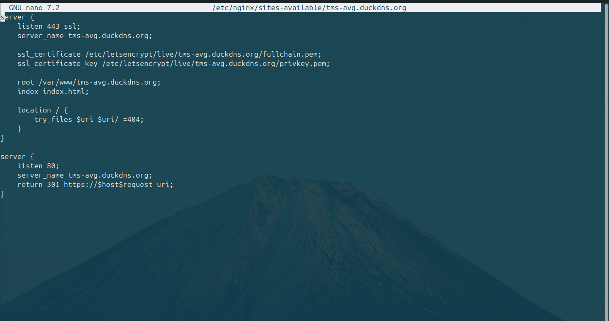
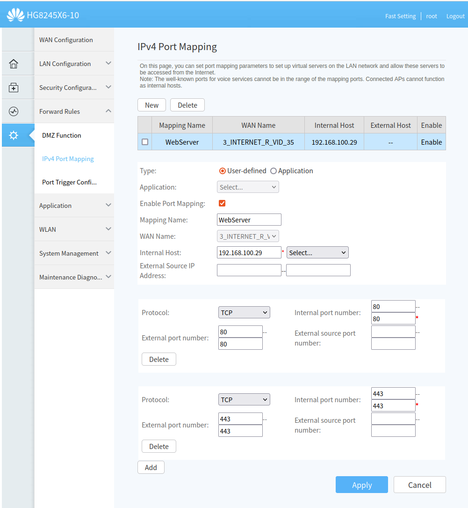
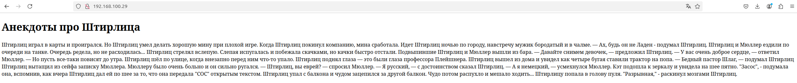
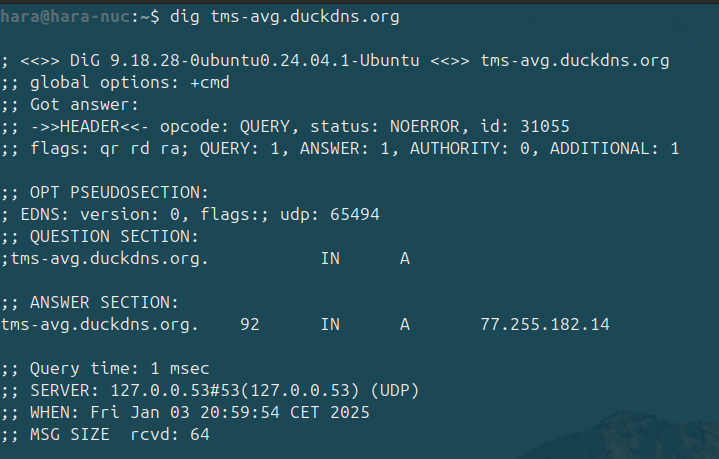
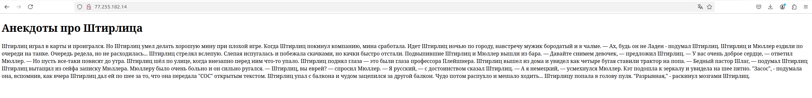
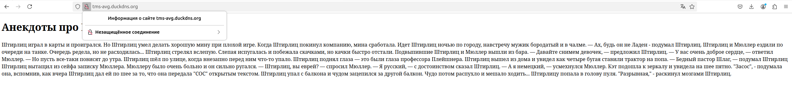
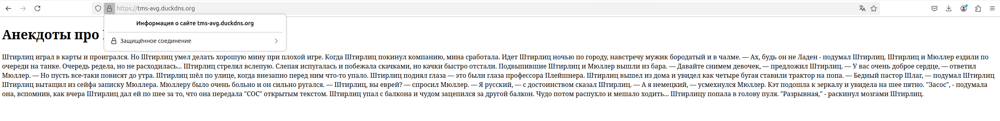
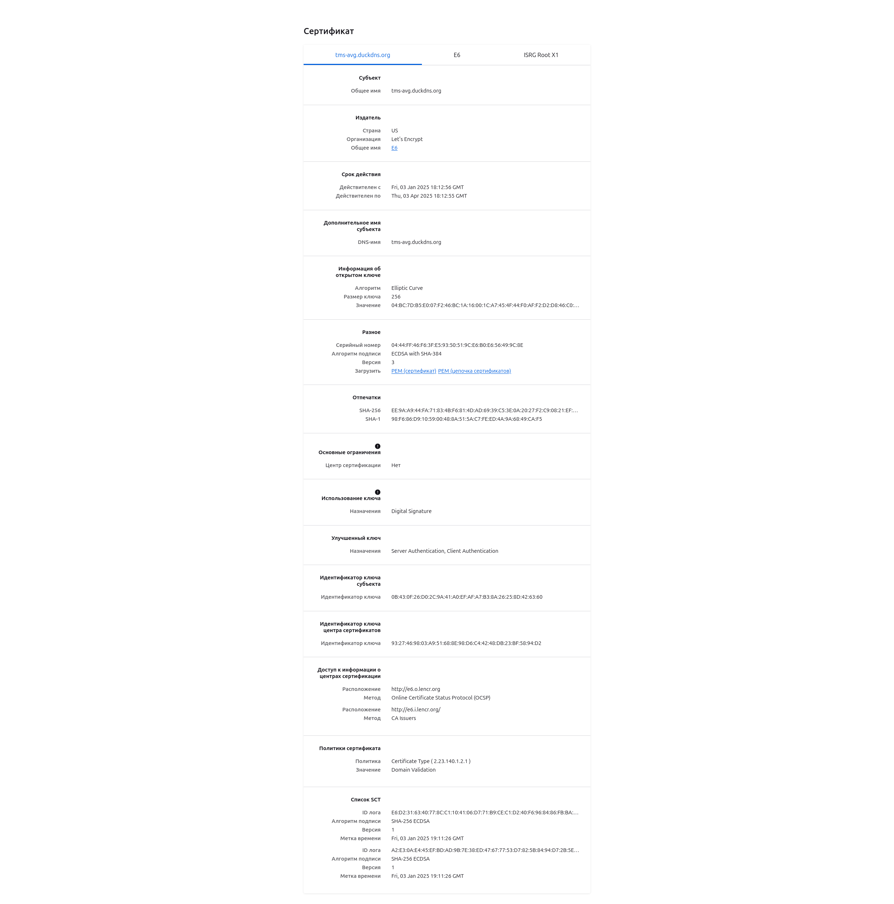

# Отчет по настройке сайта через DuckDNS и Nginx

## Цель
---
Установить и настроить Certbot на своем сервере и затем получить
и установить SSL-сертификат для вашего веб-сайта.
Задание:
Шаги:
1. Установите Certbot на свой сервер, используя инструкции,
предоставленные на сайте Certbot.
2. Запустите Certbot и запросите новый SSL-сертификат для вашего
веб-сайта. Certbot автоматически создаст CSR (запрос на подпись
сертификата) и отправит его на подпись.
3. Получите подписанный SSL-сертификат от своего провайдера
сертификатов или используйте Certbot для создания самоподписанного
сертификата.
4. Установите SSL-сертификат на вашем веб-сервере. Способ установки
зависит от конфигурации вашего сервера, но обычно это включает
добавление SSL-сертификата в конфигурацию вашего веб-сервера и
настройку HTTPS-соединения.
5. Проверьте работу вашего SSL-сертификата, используя браузер.
Убедитесь, что ваш веб-сайт открывается по HTTPS и что ваш
SSL-сертификат правильно настроен.
6. Настройте автоматическое продление SSL-сертификата с помощью
Certbot, чтобы убедиться, что ваш сертификат всегда актуален и не истекает.
---

## Выполненные шаги

### 1. Установка DuckDNS
1. Зарегистрировались на сайте [DuckDNS](https://www.duckdns.org).
2. Создали поддомен `tms-avg`.
3. Получили токен для обновления DNS-записей.

### 2. Настройка обновления IP через DuckDNS
1. Создали скрипт `duckdns-update.sh`:
    ```bash
    #!/bin/bash
    echo url="https://www.duckdns.org/update?domains=tms-avg&token=<тут_должен_быть_токен_но_я_вам_его_не_покажу>&ip=" | curl -k -o ~/duckdns.log -K -
    ```
2. Настроили автоматическое обновление IP через `cron`:
    ```bash
    crontab -e
    */5 * * * * ~/duckdns-update.sh >/dev/null 2>&1
    ```
3. Проверили выполнение скрипта вручную:
    ```bash
    ~/duckdns-update.sh
    cat ~/duckdns.log
    ```
    Убедились, что DuckDNS возвращает `OK`.

---

### 3. Настройка Nginx для сайта
1. Создали файл конфигурации `/etc/nginx/sites-available/tms-avg.duckdns.org`:
    

    Для удобства сразу же добавим настройку Certbot SSL.

2. Активировали сайт:
    ```bash
    sudo ln -s /etc/nginx/sites-available/tms-avg.duckdns.org /etc/nginx/sites-enabled/
    sudo nginx -t
    sudo systemctl reload nginx
    ```

---

### 4. Настройка маршрутизатора
1. Настроили перенаправление портов (Port Forwarding) на маршрутизаторе Huawei HG8245X6-10:
    - Внешний порт `80` -> Локальный порт `80` на IP `192.168.100.29`.
    - Внешний порт `443` -> Локальный порт `443` на IP `192.168.100.29` (потому что требуется HTTPS).
    

---

### 5. Проверка работы сайта
1. Проверили доступ к сайту локально через IP:
    ```
    http://192.168.100.29
    ```
    


2. Проверили DNS-запись для домена и проверяем внешний IP:
    ```bash
    dig tms-avg.duckdns.org
    ```
    
    


3. Очистили локальный DNS-кэш:
    ```bash
    sudo systemctl restart systemd-resolved
    ```
4. Убедились, что домен указывает на актуальный IP.
5. Проверили доступ к сайту через интернет по домену:
    ```
    http://tms-avg.duckdns.org
    ```
    


### 6. Настройка SSL-сертификата через Certbot
1. Установили Certbot и плагин для Nginx:
    ```bash
    sudo apt update
    sudo apt install -y certbot python3-certbot-nginx
    ```
2. Запросили SSL-сертификат для домена `tms-avg.duckdns.org`:
    ```bash
    sudo certbot --nginx --agree-tos --redirect --hsts --staple-ocsp --email lexagorbenko@gmail.com -d tms-avg.duckdns.org
    ```
3. Перезагрузили Nginx:
    ```bash
    sudo systemctl reload nginx
    ```
4. Проверили работу HTTPS, перейдя по адресу:
    ```
    https://tms-avg.duckdns.org
    ```
    
    


5. Настроили автоматическое продление сертификатов:
    ```bash
    sudo certbot renew --dry-run
    ```


## Результаты
1. Сайт успешно настроен для работы через домен `tms-avg.duckdns.org`.
2. DuckDNS обновляет IP автоматически каждые 5 минут.
3. Доступ к сайту возможен как локально, так и через интернет.
4. Сайт защищен SSL-сертификатом и работает по HTTPS.