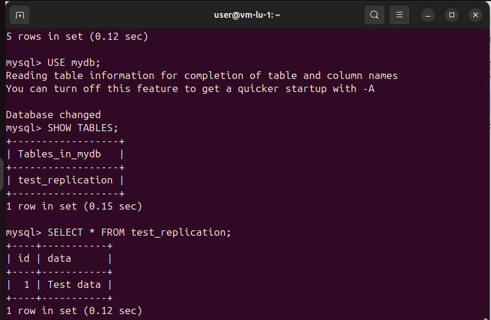
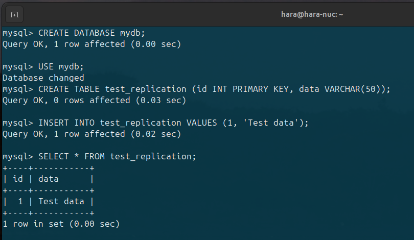
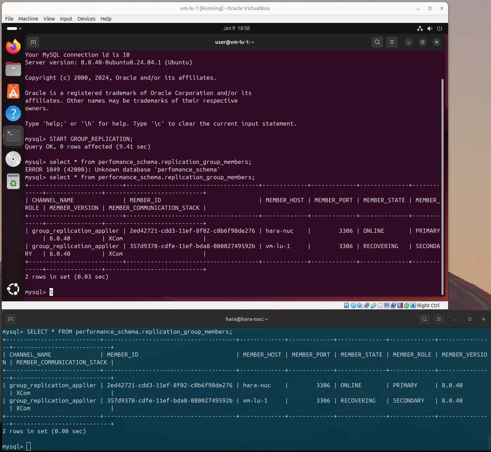

# Отчет о настройке отказоустойчивого решения для MySQL

## Цель
Реализовать отказоустойчивое решение для MySQL с репликацией, автоматическим переключением между серверами и проверкой работоспособности системы.

---

## Содержание
1. [Настройка репликации между серверами](#настройка-репликации-между-серверами)
2. [Настройка отказоустойчивости (кластер)](#настройка-отказоустойчивости-кластер)
3. [Проверка отказоустойчивости](#проверка-отказоустойчивости)
4. [Настройка резервного копирования](#настройка-резервного-копирования)

---


## Настройка репликации между серверами

### Сервер Master (192.168.100.29)

1. **Настройка конфигурации MySQL:**
    В файле `/etc/mysql/mysql.conf.d/mysqld.cnf`:
    ```ini
    [mysqld]
    #
    # * Basic Settings
    #
    user            = mysql
    server-id       = 1
    log_bin         = /var/log/mysql/mysql-bin.log
    gtid_mode       = ON
    enforce_gtid_consistency = ON
    binlog_format   = ROW
    transaction_write_set_extraction = XXHASH64

    # Group Replication Settings
    group_replication_group_name = "f159205f-7299-43df-a41a-9c5e25cef5c7"
    group_replication_start_on_boot = OFF
    group_replication_ssl_mode = REQUIRED
    group_replication_bootstrap_group = OFF
    group_replication_group_seeds = "192.168.100.29:33061,192.168.100.32:33061"
    group_replication_local_address = "192.168.100.29:33061"

    # Networking
    bind-address = 0.0.0.0
    mysqlx-bind-address = 0.0.0.0

    # Logging
    log_error = /var/log/mysql/error.log
    max_binlog_size = 100M

    ```

2. **Создание пользователя для репликации:**
    ```sql
    CREATE USER 'user'@'%' IDENTIFIED BY 'user';
    GRANT REPLICATION SLAVE ON *.* TO 'user'@'%';
    FLUSH PRIVILEGES;
    ```

3. **Перезагрузка MySQL:**
    ```bash
    sudo systemctl restart mysql
    ```

4. **Получение параметров репликации:**
    ```sql
    FLUSH TABLES WITH READ LOCK;
    SHOW MASTER STATUS;
    ```
    Записаны параметры:
    - `File`: `mysql-bin.000001`
    - `Position`: `2154`

---

### Сервер Slave (192.168.100.32)

1. **Настройка конфигурации MySQL:**
    В файле `/etc/mysql/mysql.conf.d/mysqld.cnf`:
    ```ini
    [mysqld]
    server-id=2
    relay_log=/var/log/mysql/mysql-relay-bin.log
    ```

2. **Перезагрузка MySQL:**
    ```bash
    sudo systemctl restart mysql
    ```

3. **Настройка репликации:**
    ```sql
    CHANGE MASTER TO
    MASTER_HOST='192.168.100.29',
    MASTER_USER='user',
    MASTER_PASSWORD='user',
    MASTER_LOG_FILE='mysql-bin.000001',
    MASTER_LOG_POS=2154;
    START SLAVE;
    ```

4. **Проверка статуса репликации:**
    ```sql
    SHOW SLAVE STATUS\G;
    ```
    Убедились, что `Slave_IO_Running` и `Slave_SQL_Running` имеют значение `Yes`.




---

## Настройка отказоустойчивости (кластер)

Использовалась **MySQL Group Replication**.

1. **Настройка SSL:**
    На обоих серверах:
    ```bash
    sudo mysql_ssl_rsa_setup --uid=mysql
    ```

2. **Обновление конфигурации MySQL:**
    В файле `/etc/mysql/mysql.conf.d/mysqld.cnf`:
    ```ini
    [mysqld]
    server-id=<1 или 2>
    gtid_mode=ON
    enforce_gtid_consistency=ON
    log_bin=binlog
    binlog_format=ROW
    transaction_write_set_extraction=XXHASH64
    group_replication_group_name="f159205f-7299-43df-a41a-9c5e25cef5c7"
    group_replication_start_on_boot=OFF
    group_replication_ssl_mode=REQUIRED
    group_replication_bootstrap_group=OFF
    group_replication_group_seeds="192.168.100.29:33061,192.168.100.32:33061"
    ```

3. **Запуск Group Replication:**
    - На Master:
        ```sql
        SET GLOBAL group_replication_bootstrap_group=ON;
        START GROUP_REPLICATION;
        SET GLOBAL group_replication_bootstrap_group=OFF;
        ```
    - На Slave:
        ```sql
        START GROUP_REPLICATION;
        ```

4. **Проверка состояния кластера:**
    ```sql
    SELECT * FROM performance_schema.replication_group_members;
    ```
    Убедились, что оба сервера имеют статус `ONLINE`.




---


## Проверка отказоустойчивости

### 1. Отключение Master
- Остановили MySQL на Master:
    ```bash
    sudo systemctl stop mysql
    ```
- Подключились к Slave и выполнили тестовые операции.

### 2. Включение Master
- Запустили MySQL на Master:
    ```bash
    sudo systemctl start mysql
    ```
- Убедились, что Master автоматически подключился к группе.

### 3. Отключение Slave
- Остановили MySQL на Slave:
    ```bash
    sudo systemctl stop mysql
    ```
- Выполнили тестовые операции на Master.

### 4. Включение Slave
- Запустили MySQL на Slave и проверили синхронизацию данных.

---

## Настройка резервного копирования

1. **Скрипт резервного копирования:**
    ```bash
    #!/bin/bash
    mysqldump -u root -p --all-databases > /backup/mysql_backup_$(date +%F).sql
    scp /backup/mysql_backup_$(date +%F).sql user@192.168.100.50:/path/to/backup/
    ```

2. **Добавление в cron:**
    ```bash
    crontab -e
    ```
    ```text
    0 2 * * * /path/to/backup_script.sh
    ```

---

## Итоги
- Настроена репликация между Master и Slave.
- Реализовано отказоустойчивое решение с использованием MySQL Group Replication.
- Выполнены проверки симуляции отказа серверов.
- Настроена система резервного копирования.
