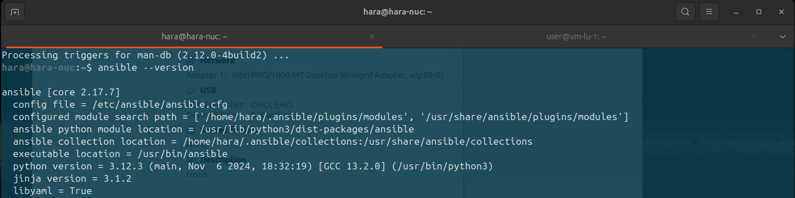
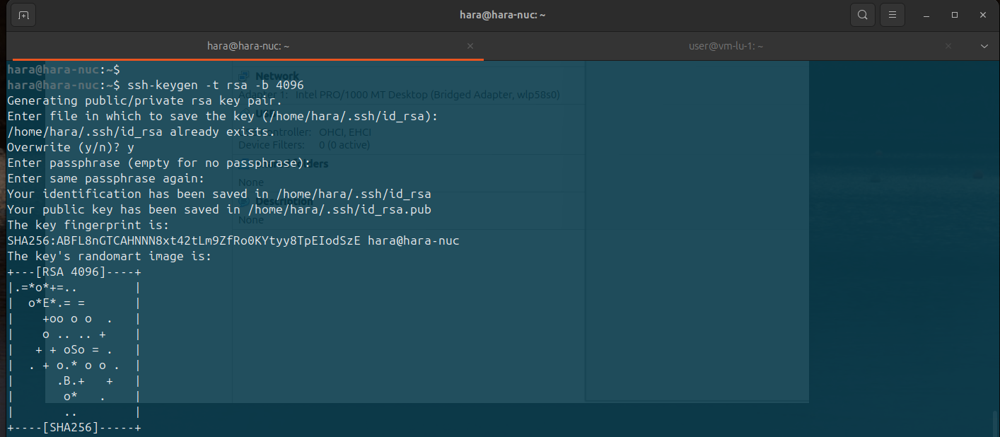
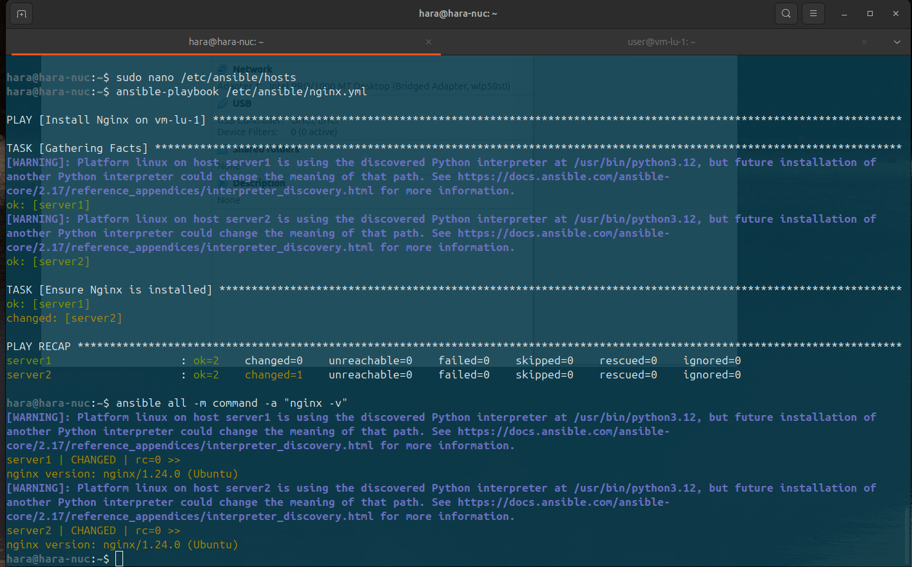

## Цель
Получить практический опыт работы с системой управления конфигурацией Ansible. Настроить окружение Ansible на локальной машине и управлять удаленными серверами.

## Выполненные шаги

### 1. Установка Ansible
На основном сервере с IP-адресом `192.168.100.29` выполнены следующие действия:
1. Обновлен список пакетов:
   ```bash
   sudo apt update
   ```
2. Установлен пакет `software-properties-common` для добавления репозиториев:
   ```bash
   sudo apt install software-properties-common
   ```
3. Добавлен PPA-репозиторий Ansible:
   ```bash
   sudo apt-add-repository ppa:ansible/ansible
   ```
4. Повторно обновлен список пакетов:
   ```bash
   sudo apt update
   ```
5. Установлен Ansible:
   ```bash
   sudo apt install ansible
   ```
6. Проверена установка:
   ```bash
   ansible --version
   ```


---

### 2. Генерация SSH-ключа и настройка доступа
1. На основном сервере сгенерирован SSH-ключ:
   ```bash
   ssh-keygen -t rsa -b 4096
   ```
   Ключ сохранен в файле по умолчанию `/home/user/.ssh/id_rsa`.

2. Ключ скопирован на второй сервер с IP-адресом `192.168.100.32`:
   ```bash
   ssh-copy-id user@192.168.100.32
   ```
   После копирования выполнена проверка соединения:
   ```bash
   ssh user@192.168.100.32
   ```


---

### 3. Настройка инвентарного файла
1. Создан инвентарный файл `/etc/ansible/hosts` со следующим содержимым:
   ```ini
   [servers]
   server1 ansible_host=192.168.100.29 ansible_user=user ansible_ssh_private_key_file=/home/user/.ssh/id_rsa
   server2 ansible_host=192.168.100.32 ansible_user=user ansible_ssh_private_key_file=/home/user/.ssh/id_rsa
   ```

### 4. Настройка конфигурации Ansible
1. Создан файл конфигурации `/etc/ansible/ansible.cfg` со следующим содержимым:
   ```ini
   [defaults]
   inventory = /etc/ansible/hosts
   remote_user = user
   private_key_file = /home/user/.ssh/id_rsa
   ```

### 5. Создание и запуск плейбука
1. Создан плейбук `/etc/ansible/nginx.yml` для установки Nginx на серверах:
   ```yaml
   ---
   - name: Install Nginx on vm-lu-1
     hosts: servers
     become: true
     tasks:
       - name: Ensure Nginx is installed
         apt:
           name: nginx
           state: present
   ```
2. Запущен плейбук для установки Nginx:
   ```bash
   ansible-playbook /etc/ansible/nginx.yml
   ```

### 6. Проверка состояния серверов
1. Проверено, что Nginx установлен на всех серверах:
   ```bash
   ansible all -m command -a "nginx -v"
   ```



---

## Результаты
- Ansible успешно установлен и настроен на основном сервере (`192.168.100.29`).
- Настроено управление вторым сервером (`192.168.100.32`) через Ansible.
- С помощью плейбука установлен веб-сервер Nginx на обоих серверах.

## Выводы
Настройка Ansible и управление серверами через него значительно упрощают автоматизацию задач и позволяют легко развертывать приложения. Получен практический опыт работы с Ansible, который может быть применен для управления конфигурацией в более сложных инфраструктурах.
