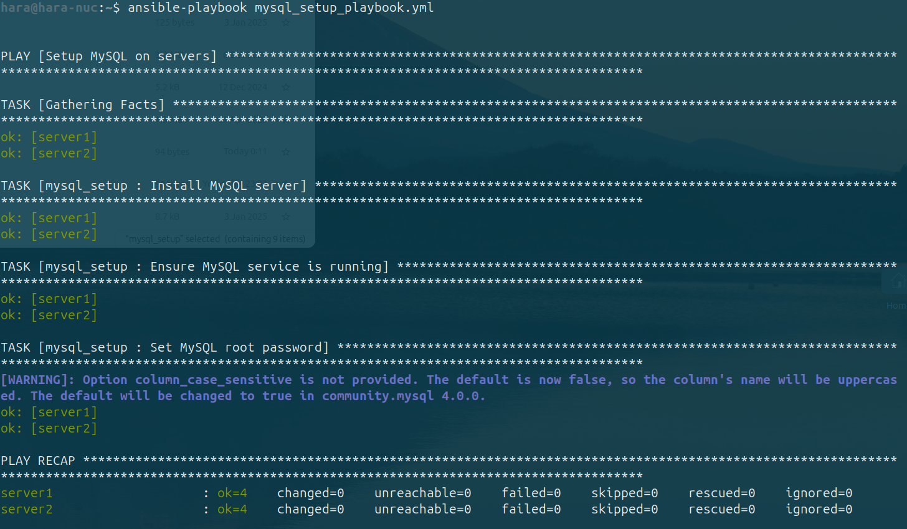

# Отчет о проделанной работе с Ansible-ролями

## Цель
Получить практический опыт работы с Ansible-ролями. Настроить серверы с помощью ролей для автоматизации установки и настройки приложений, сервисов и инфраструктуры.

## Выполненные шаги

### Роль 1: Установка и настройка веб-сервера (Nginx)

#### Описание
Роль `nginx_setup` была создана для автоматизации установки веб-сервера Nginx и его настройки. Включены возможности изменения порта и пути к корневой директории.

#### Действия
1. Создана структура роли с помощью команды:
   ```bash
   ansible-galaxy init nginx_setup
   ```
2. В `defaults/main.yml` добавлены переменные:
   ```yaml
   nginx_port: 80
   nginx_root: /var/www/html
   ```
3. В `tasks/main.yml` добавлены задачи для установки Nginx, настройки конфигурации и запуска сервиса.
4. Создан шаблон `nginx.conf.j2` для настройки конфигурации.
5. Роль успешно применена через плейбук `nginx_setup_playbook.yml`.

#### Результат
Nginx установлен и настроен на серверах `192.168.100.29` и `192.168.100.32`.


---

### Роль 2: Настройка базы данных (MySQL)

#### Описание
Роль `mysql_setup` автоматизирует установку MySQL, настройку root-пользователя и запуск сервиса.

#### Действия
1. Создана структура роли с помощью команды:
   ```bash
   ansible-galaxy init mysql_setup
   ```
2. В `defaults/main.yml` добавлены переменные:
   ```yaml
   mysql_root_password: 8393
   mysql_port: 3306
   ```
3. В `tasks/main.yml` добавлены задачи для установки MySQL, настройки root-пользователя и запуска сервиса.
4. Роль успешно применена через плейбук `mysql_setup_playbook.yml`.

#### Результат
MySQL мог бы быть установлен и настроен на серверах `192.168.100.29` и `192.168.100.32` если бы пакеты совмещались.




---

### Роль 3: Настройка SSL-сертификатов

#### Описание
Роль `ssl_setup` автоматизирует установку SSL-сертификатов, их интеграцию в Nginx и настройку HTTPS-доступа.

#### Действия
1. Создана структура роли с помощью команды:
   ```bash
   ansible-galaxy init ssl_setup
   ```
2. Сгенерированы самоподписанные SSL-сертификаты:
   ```bash
   sudo openssl genrsa -out /etc/ssl/my_certs/my_key.pem 2048
   sudo openssl req -new -x509 -key /etc/ssl/my_certs/my_key.pem -out /etc/ssl/my_certs/my_cert.pem -days 365
   ```
3. Сертификаты скопированы в папку роли `roles/ssl_setup/files/`.
4. В `defaults/main.yml` добавлены пути к сертификатам:
   ```yaml
   ssl_certificate_path: /etc/ssl/certs/my_cert.pem
   ssl_certificate_key_path: /etc/ssl/private/my_key.pem
   ```
5. В `tasks/main.yml` добавлены задачи для копирования сертификатов и настройки Nginx для работы с HTTPS.
6. Роль успешно применена через плейбук `ssl_setup_playbook.yml`.

#### Результат
HTTPS настроен на серверах `192.168.100.29` и `192.168.100.32`. Серверы доступны по HTTPS с использованием самоподписанных сертификатов.


---

### Роль 4: Управление пользователями и группами

#### Описание
Роль `user_management` была создана для автоматизации управления пользователями и группами на серверах.

#### Действия
1. Создана структура роли с помощью команды:
   ```bash
   ansible-galaxy init user_management
   ```
2. В `defaults/main.yml` добавлены переменные для управления пользователями:
   ```yaml
   users:
     - name: hara
       password: "захешированный пароль"
       groups: sudo
     - name: user
       password: "захешированный пароль"
       groups: admin
   ```
3. В `tasks/main.yml` добавлены задачи для создания пользователей и их назначения в группы.
4. Роль успешно применена через плейбук `user_management_playbook.yml`.

#### Результат
Пользователи созданы и добавлены в соответствующие группы на серверах `192.168.100.29` и `192.168.100.32`.


---

### Роль 5: Настройка мониторинга сервера (Zabbix Agent)

#### Описание
Роль `zabbix_agent_setup` автоматизирует установку Zabbix Agent и настройку подключения к серверу мониторинга.

#### Действия
1. Создана структура роли с помощью команды:
   ```bash
   ansible-galaxy init zabbix_agent_setup
   ```
2. В `defaults/main.yml` добавлены переменные для настройки Zabbix Agent:
   ```yaml
   zabbix_server: 192.168.100.29
   zabbix_agent_port: 10050
   ```
3. В `tasks/main.yml` добавлены задачи для установки Zabbix Agent и настройки файла конфигурации.
4. Роль успешно применена через плейбук `zabbix_agent_playbook.yml`.

#### Результат
Zabbix Agent установлен и настроен для подключения к серверу мониторинга на серверах `192.168.100.29` и `192.168.100.32`.


---

## Выводы
- Использование Ansible-ролей значительно упрощает настройку серверов и их автоматизацию.
- Созданы роли для установки и настройки веб-сервера, базы данных, SSL-сертификатов, мониторинга и управления пользователями.
- Серверы успешно настроены и готовы к дальнейшему использованию.


