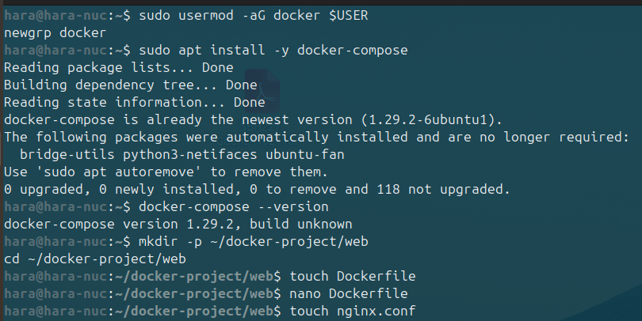
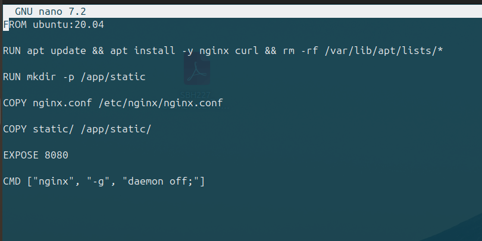
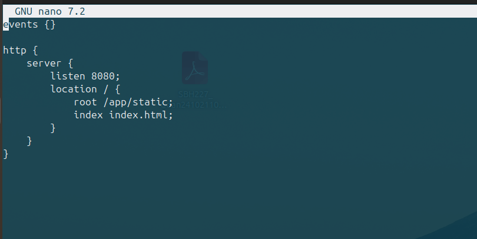
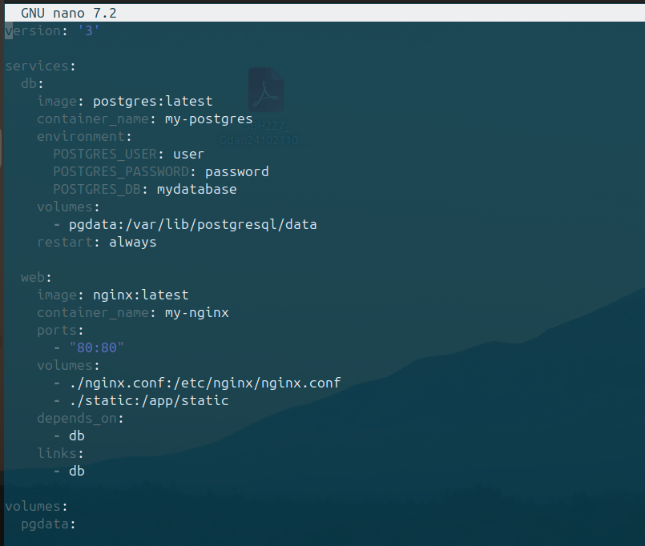
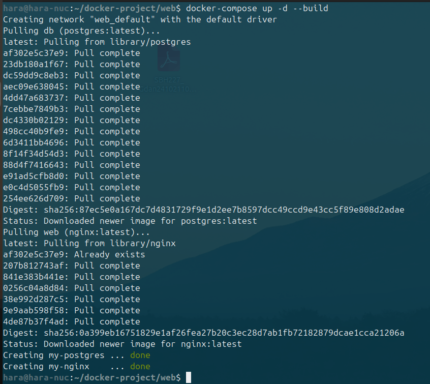

# Отчет по проделанной работе

## Установка Docker и Docker Compose

Для развертывания приложения было необходимо установить Docker и Docker Compose на Ubuntu.

### Команды установки:
```bash
sudo apt update
sudo apt install -y docker.io
sudo apt install -y docker-compose
```

### Проверка установки:
```bash
docker --version
docker-compose --version
```



---

## Создание Dockerfile и конфигурации Nginx

Был создан `Dockerfile` для развертывания веб-сервера с использованием `nginx`. Также создан файл конфигурации `nginx.conf`.

### Содержимое Dockerfile:
```dockerfile
# Указываем базовый образ Ubuntu 20.04
FROM ubuntu:20.04

# Устанавливаем нужные пакеты (nginx, curl)
RUN apt update && apt install -y nginx curl && rm -rf /var/lib/apt/lists/*

# Создаем каталог для статических файлов
RUN mkdir -p /app/static

# Копируем файл конфигурации Nginx
COPY nginx.conf /etc/nginx/nginx.conf

# Копируем статические файлы
COPY static/ /app/static/

# Открываем порт 8080
EXPOSE 8080

# Запускаем Nginx
CMD ["nginx", "-g", "daemon off;"]
```


### Содержимое nginx.conf:
```nginx
events {}

http {
    server {
        listen 8080;
        location / {
            root /app/static;
            index index.html;
        }
    }
}
```


---

## Сборка и запуск контейнера

### Сборка образа
```bash
docker build -t my-nginx .
```

### Запуск контейнера
```bash
docker run -d -p 8080:8080 --name my-nginx-container my-nginx
```


### Проверка работы
```bash
curl http://localhost:8080
```


---

## Развертывание с помощью Docker Compose

Был создан файл `docker-compose.yml` для запуска веб-сервера `nginx` и базы данных `PostgreSQL`.

### Содержимое `docker-compose.yml`:
```yaml
version: '3'

services:
  db:
    image: postgres:latest
    container_name: my-postgres
    environment:
      POSTGRES_USER: user
      POSTGRES_PASSWORD: password
      POSTGRES_DB: mydatabase
    volumes:
      - pgdata:/var/lib/postgresql/data
    restart: always

  web:
    image: nginx:latest
    container_name: my-nginx
    ports:
      - "80:80"
    volumes:
      - ./nginx.conf:/etc/nginx/nginx.conf
      - ./static:/app/static
    depends_on:
      - db
    links:
      - db

volumes:
  pgdata:
```


### Запуск `docker-compose`
```bash
docker-compose up -d
```


---

## Итоги

В ходе выполнения работы:
- Установлены **Docker** и **Docker Compose**.
- Создан **Dockerfile** для веб-сервера на **nginx**.
- Написан **nginx.conf** для раздачи статических файлов.
- Собран и запущен **Docker-контейнер** с веб-сервером.
- Создан и запущен **docker-compose** с базой данных PostgreSQL и веб-сервером.
- Проверена работоспособность с помощью **curl** и браузера.
