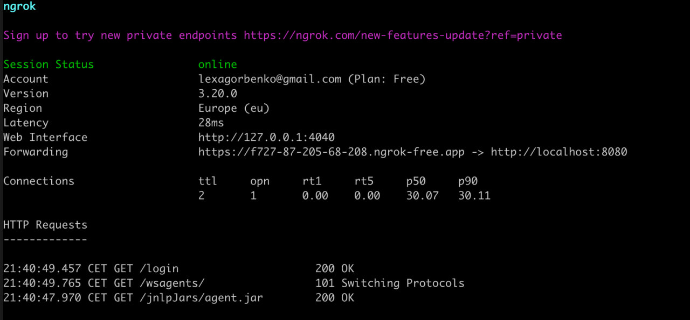
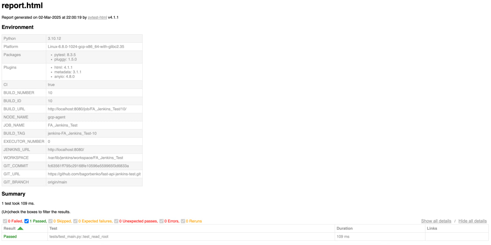
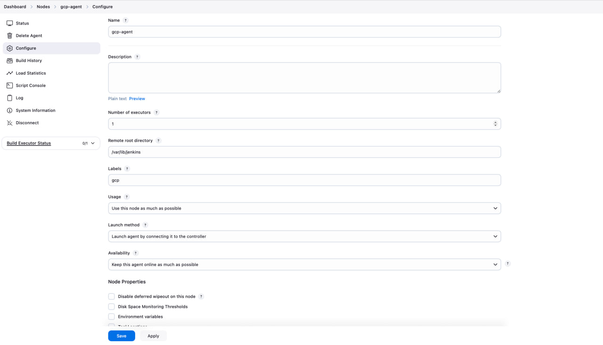

# Отчет по выполнению домашнего задания

## 📌 Задание
### 1. Установка и настройка агента Jenkins на удаленном компьютере
- В качестве удаленного агента был использован сервер GCP с ОС Ubuntu 22.04.
- Агент был подключен к основному серверу Jenkins, установленному локально (Macbook).
- Для проброса соединения с локального сервера на GCP был настроен **ngrok**, так как локальная машина находится за NAT.
- Скрин подключения через ngrok:
    

---

### 2. Создание pipeline на основном сервере Jenkins
- Создан pipeline под названием **FA_Jenkins_Test**.
- Pipeline настроен на выполнение на агенте с меткой `gcp`.
- Код для pipeline находится в репозитории:  
    [GitHub Repository](https://github.com/bagorbenko/fast-api-jenkins-test)

---

### 3. Добавление шагов сборки в pipeline
- В pipeline добавлены следующие этапы:
    - **Checkout** - клонирование кода проекта из репозитория.
    - **Setup Python Environment** - создание виртуального окружения и установка зависимостей.
    - **Run Tests** - запуск тестов с формированием JUnit и HTML отчетов.
    - **Deploy (пустой заглушка)** - для демонстрации этапа.
- Все шаги реализованы с использованием синтаксиса **Pipeline Script (Declarative)**.

---

### 4. Настройка отчетности
- Для сбора отчетов в Jenkins настроено:
    - **JUnit Plugin** - для публикации отчетов JUnit.
    - **HTML Publisher Plugin** - для публикации HTML отчета с результатами тестов.
- Скрин HTML-отчета:
    

---

### 5. Настройка безопасности агента
- Для подключения агента был сгенерирован SSH-ключ.
- Ключ добавлен в `~/.ssh/authorized_keys` на агенте.
- В настройках агента Jenkins установлена стратегия проверки ключей **Known Hosts File Verification Strategy**.
- Список известных хостов (`known_hosts`) был обновлен с помощью команды:
    ```
    ssh-keyscan github.com >> ~/.ssh/known_hosts
    ```
- Для передачи кода между мастер-сервером Jenkins и агентом используется защищенное SSH-соединение.
- Скрин с настройками агента прилагается.
    

---

### 6. Поддержка гибридных окружений
- Агент развернут в облаке GCP.
- Основной сервер Jenkins находится на локальной машине (macOS).
- Связь между ними обеспечивается через **ngrok**, что позволяет гибко подключать агента из облачного окружения к локальному серверу.

---

### 7. Уведомления в Telegram
- В pipeline добавлены уведомления в Telegram о статусе каждого билда.
- При успешном или неуспешном билде отправляется сообщение с информацией:
    - Статус билда.
    - Название проекта.
    - Номер билда.
    - Ссылка на билд.
- Также в чат прикрепляется HTML-отчет о выполненных тестах.
- Скриншот уведомления в Telegram:
    

---

### 📦 Описание тестового приложения
- Приложение реализовано на **FastAPI**.
- Функциональность:
    - Эндпоинт `/` - простая проверка работы сервиса.
    - Тесты написаны с использованием **pytest** и библиотеки **httpx** для асинхронных запросов.
- Основная задача pipeline - убедиться, что приложение успешно билдится и проходит тесты.

---