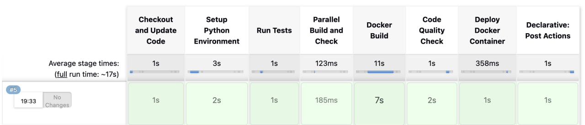
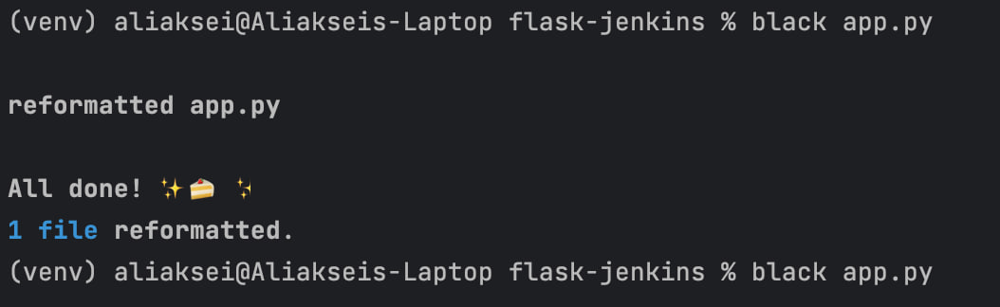
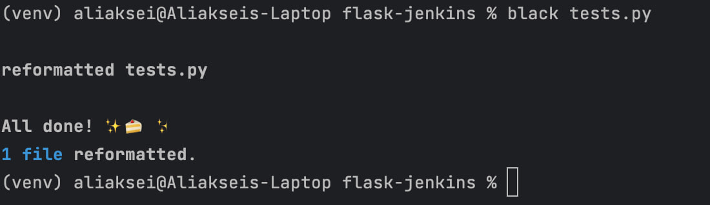

# CI/CD Pipeline Setup Report

## 📌 Задание
Настроить CI/CD pipeline для проекта на Python (Flask), используя Jenkins и Docker. Обеспечить автоматическую проверку качества кода, тестирование и сборку приложения в контейнер.

---

## ✅ Выполненные шаги

### 1. Репозиторий проекта
- URL: [https://github.com/bagorbenko/flask-jenkins](https://github.com/bagorbenko/flask-jenkins)

### 2. Настроен Jenkins Pipeline
- Используется declarative pipeline с параметром `ENV` (dev/prod).
- Автоматический запуск при пуше в GitHub.

### 3. Этапы pipeline
- **Checkout and Update Code** — загрузка кода из GitHub
- **Setup Python Environment** — установка зависимостей через `requirements.txt`
- **Run Tests** — запуск unit-тестов с помощью `pytest`
- **Parallel Build and Check**:
  - `Docker Build` — сборка Docker-образа
  - `Code Quality Check` — проверка кода средствами `black` и `flake8`
- **Deploy Docker Container** — развёртывание приложения в Docker (если тесты и проверки прошли)



### 4. Dockerfile
Создан `Dockerfile` со следующей конфигурацией:
```dockerfile
FROM python:3.11
WORKDIR /app
COPY requirements.txt .
RUN pip install --no-cache-dir -r requirements.txt
COPY . .
EXPOSE 5000
CMD ["gunicorn", "-b", "0.0.0.0:5000", "app:app"]
```

### 5. Форматирование и проверка кода
- Используются:
  - `black` — автоформатирование
  - `flake8` — линтинг
- Подключены в `requirements.txt`
- Проверка кода выполняется в Jenkins




### 6. Jenkins уведомления
- В Telegram отправляются уведомления о результате билда, включая commit, автора и окружение.
