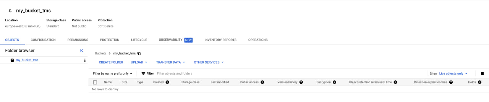
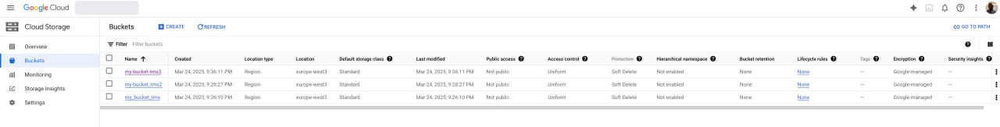
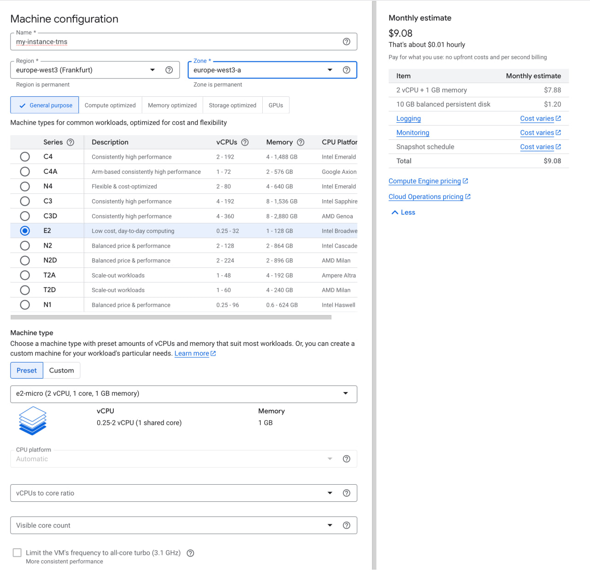
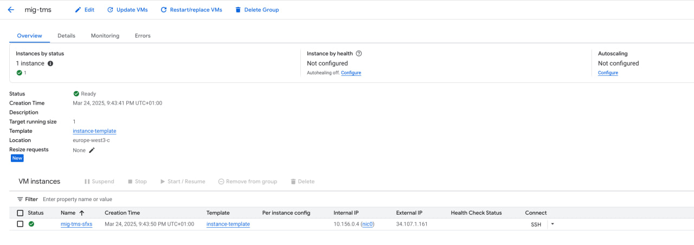
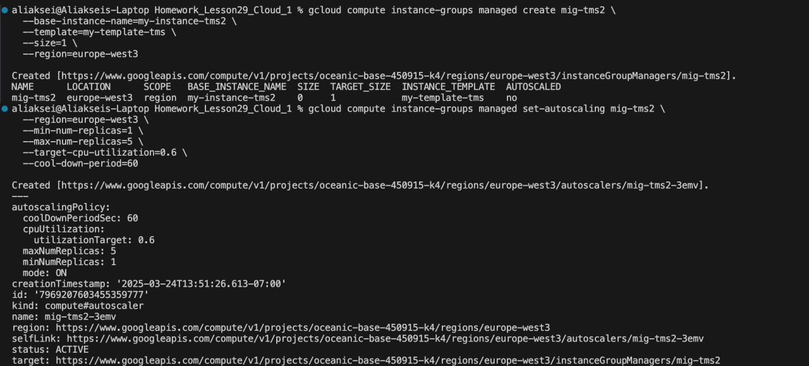

# Отчёт по выполнению задания: GCP Cloud Storage и Compute Engine

## Задание 1: Создание Cloud Storage Bucket тремя способами

### ✅ Через GUI (Web Console)
- Перешёл в раздел **Cloud Storage → Buckets**
- Создал бакеты `my-bucket_tms2` и `my_bucket_tms`
- Регион: `europe-west3 (Frankfurt)`
- Класс хранения: `Standard`
- Access control: `Uniform`

### ✅ Через CLI (gcloud)
```bash
gcloud storage buckets create gs://my-bucket-tms2   --location=europe-west3   --uniform-bucket-level-access
```
- Бакет успешно создан в регионе Франкфурт

### ✅ Через Terraform
```hcl
resource "google_storage_bucket" "my_bucket" {
  name     = "my-bucket-tms3"
  location = "europe-west3"

  uniform_bucket_level_access = true
}
```
- Бакет был развёрнут через Terraform командой `terraform apply`





---

## Задание 2: Создание Compute Engine + масштабирование (3 способа)

### ✅ Через GUI (Web Console)
- Создан Instance Template: `instance-template`
- Создан Managed Instance Group: `mig-tms`
- Регион: `europe-west3`
- Тип машины: `e2-micro`, образ: Ubuntu 20.04
- Настроен autoscaling: 1-5 инстансов при 60% CPU

### ✅ Через CLI (gcloud)
- Использован шаблон `my-template-tms`

```bash
gcloud compute instance-groups managed create mig-tms2   --base-instance-name=my-instance-tms2   --template=my-template-tms   --size=1   --region=europe-west3

gcloud compute instance-groups managed set-autoscaling mig-tms2   --region=europe-west3   --min-num-replicas=1   --max-num-replicas=5   --target-cpu-utilization=0.6   --cool-down-period=60
```
- Группа `mig-tms2` успешно создана и отображается в UI

### ✅ Через Terraform 
СДЕЛАНО И ПРОВЕРЕНО ПРЕПОДАВАТЕЛЕМ НА ЛЕКЦИИ!
*(просмотреть можно в lesson_task)*




