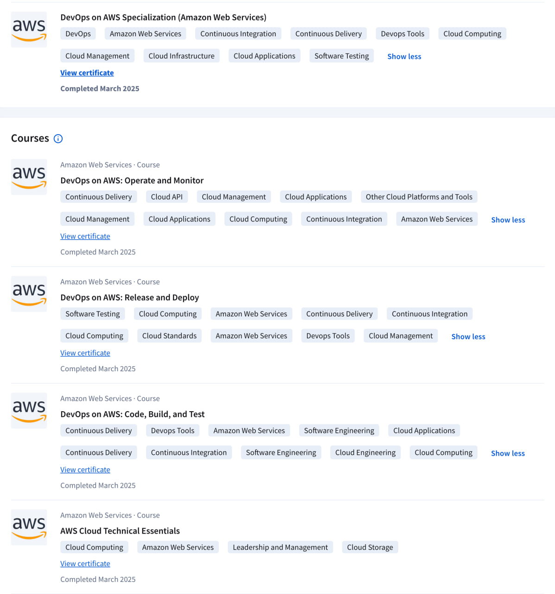

# Отчет о прохождении курса **DevOps on AWS** (модуль: Cloud)

**Период обучения:** Март 2025  
**Платформа:** Coursera (Amazon Web Services)

## Цель

Изучение и закрепление ключевых концепций облачной инфраструктуры и DevOps-практик с использованием Amazon Web Services (AWS) для повышения квалификации и практического применения в рабочих задачах.

## Пройденные модули, релевантные теме "Cloud":

### 1. **DevOps on AWS: Operate and Monitor**
- Освоены основы управления облачными приложениями и инфраструктурой.
- Изучены инструменты мониторинга и операционного контроля в AWS.
- Получены навыки использования CloudWatch и других API-интерфейсов для сбора метрик и логов.

### 2. **DevOps on AWS: Release and Deploy**
- Подробно разобрана работа с облачными стандартами и методами безопасного деплоя.
- Использование AWS CodeDeploy, Elastic Beanstalk и других средств для управления облачными релизами.

### 3. **DevOps on AWS: Code, Build, and Test**
- Получены практические знания по CI/CD пайплайнам в контексте облачных сред.
- Применение AWS CodePipeline и CodeBuild в задачах автоматизации тестирования и сборки.

### 4. **AWS Cloud Technical Essentials**
- Базовые принципы работы облака AWS: регионы, зоны доступности, виртуальные машины (EC2), хранилища (S3).
- Понимание управления правами доступа (IAM), безопасности и масштабирования облачных решений.
- Подготовка среды для запуска облачных приложений с учетом лучших практик AWS.

## Результаты

- Все модули завершены в марте 2025 года.
- Получены соответствующие сертификаты.
- Модуль **Cloud** полностью пройден, охватывает ключевые технологии и практики AWS: Cloud Computing, Cloud Management, Cloud Applications, Cloud Infrastructure, Cloud Storage.

## Модули

**Сертификат:**  
- [DevOps on AWS Specialization – View Certificate](https://coursera.org/verify/specialization/TKKE619HRWER)  

