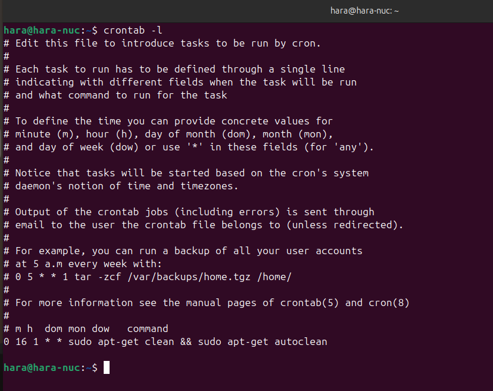
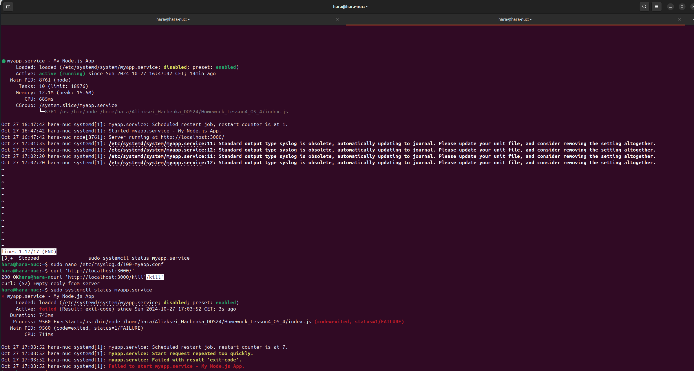
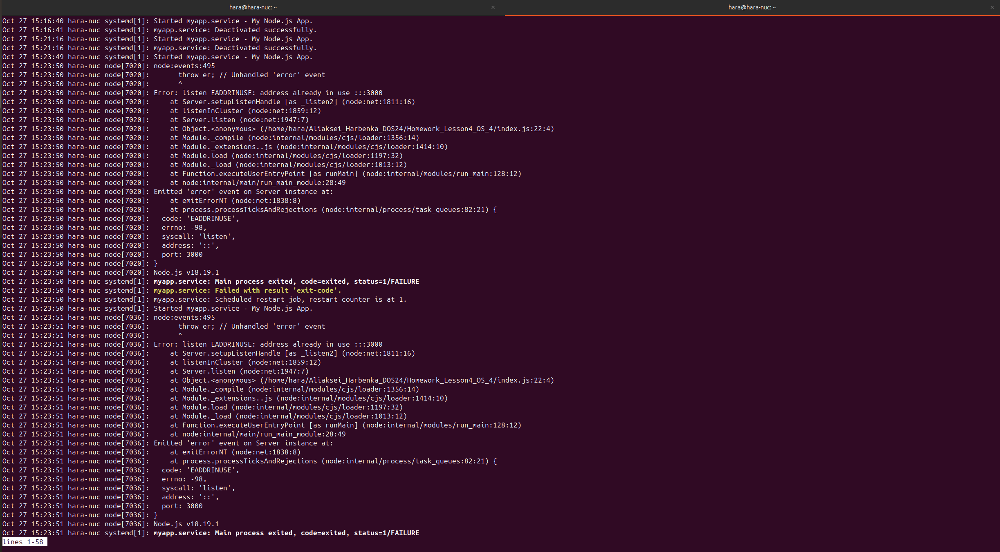

# Отчет по домашнему заданию

## Цель
Получить практический опыт установки пакетов с помощью сторонних репозиториев и пакетного менеджера. Научиться выполнять задачи автоматизации с помощью Bash.

## Задание 1: Очистка кэша apt

В задании необходимо было добавить в `cron` скрипт/команду, которая будет очищать кэш apt (кэшируемые пакеты, пакеты, которые не могут быть загружены) раз в месяц в 16 часов.

### Решение
Добавил следующую команду в crontab:

```bash
# Открываем crontab для редактирования
crontab -e
```

```cron
0 16 1 * * apt-get clean
```

### Проверка
Список текущих заданий в cron:

```bash
crontab -l
```



---

## Задание 2: Запуск Node.js приложения через systemd

В этом задании мы запустили демон Node.js приложения через systemd.

### Код приложения
Используемый код для Node.js приложения:

```javascript
const http = require('http');
// Получаем MYAPP_PORT из переменной окружения
const MYAPP_PORT = process.env.MYAPP_PORT;
http.createServer((req, res) => {
  if (req.url === '/kill') {
    // Приложение завершится с ошибкой
    throw new Error('Someone kills me');
  }
  if (req.method === 'POST') {
    console.error(`Error: Request ${req.method} ${req.url}`);
    res.writeHead(405, { 'Content-Type': 'text/plain' });
    res.end('405 Method Not Allowed');
    return;
  }
  console.log(`Request ${req.method} ${req.url}`);
  res.writeHead(200, { 'Content-Type': 'text/plain' });
  res.end('200 OK');
})
.listen(MYAPP_PORT);
```

### Конфигурация systemd
Файл юнита `/etc/systemd/system/myapp.service`:

```ini
[Service]
Environment=MYAPP_PORT=3000
ExecStart=/usr/bin/node /home/hara/Aliaksei_Harbenka_DOS24/Homework_Lesson4_OS_4/index.js
Restart=always
User=www-data
Group=www-data
StandardOutput=syslog
StandardError=syslog
SyslogIdentifier=myapp
```

### Запуск и проверка статуса сервиса
Запустил сервис с помощью:

```bash
sudo systemctl start myapp.service
sudo systemctl status myapp.service
```

### Проверка работы приложения
Для проверки работы приложения использовал команду:

```bash
curl 'http://localhost:3000/'
```



---

## Логирование
Для логирования настроил вывод в syslog. Логи приложения можно просмотреть с помощью команды:

```bash
journalctl -u myapp.service
```



