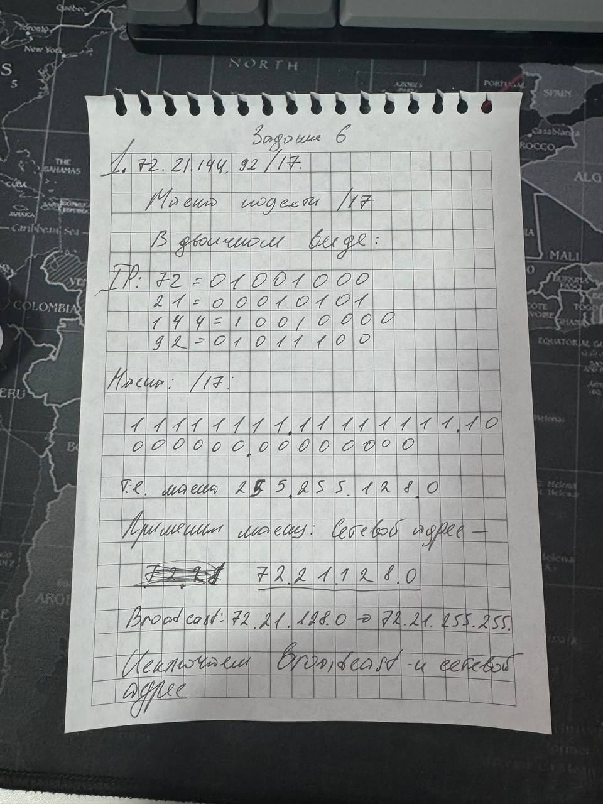
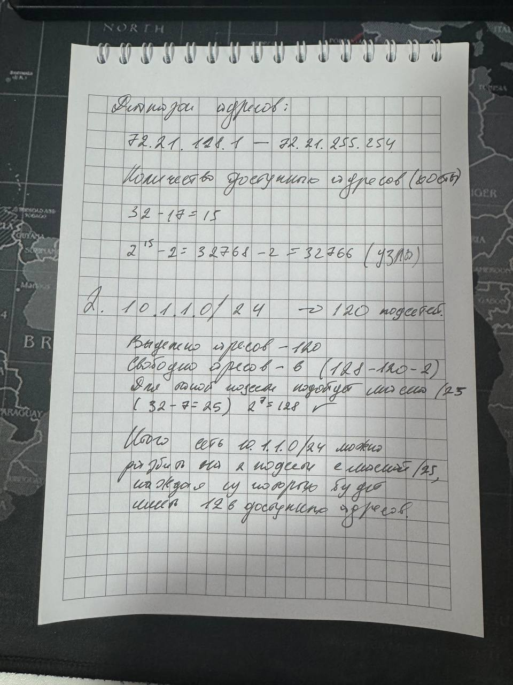

# Отчет по заданию: Подсети и вычисления

## Задача 1: Параметры сети 72.21.144.92/17

1. **Сетевой адрес**: 72.21.128.0
2. **Широковещательный адрес**: 72.21.255.255
3. **Диапазон адресов узлов**: 72.21.128.1 – 72.21.255.254
4. **Количество созданных подсетей**: 1
5. **Количество узлов в подсети**: 32,766

---

## Задача 2: Подсети сети 10.1.1.0/24

Для сети 10.1.1.0/24 с маской /25 (минимум 120 доступных адресов):
- **Количество подсетей**: 2
- **Доступных адресов в каждой подсети**: 126

| **Подсеть** | **Сетевой адрес** | **Диапазон узлов**       | **Широковещательный адрес** |
|-------------|-------------------|--------------------------|-----------------------------|
| **Подсеть 1** | 10.1.1.0/25       | 10.1.1.1 – 10.1.1.126    | 10.1.1.127                  |
| **Подсеть 2** | 10.1.1.128/25     | 10.1.1.129 – 10.1.1.254  | 10.1.1.255                  |

---

## Заключение
Обе задачи выполнены: для первой сети определены все параметры, а вторая сеть разбита на подсети с необходимым количеством адресов.
Все вычисления были выполнены вручную, и для подтверждения приведены фотографии решения.

