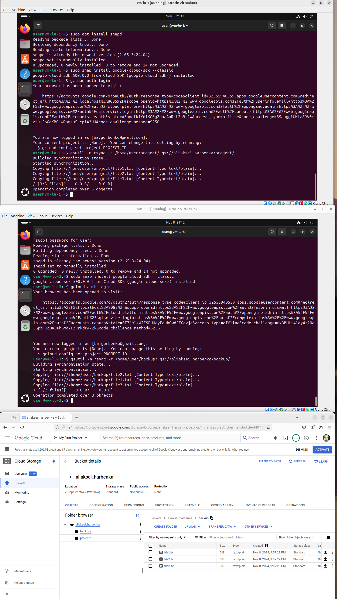

# Отчет по домашней работе

## Введение

В данной домашней работе были выполнены несколько задач, связанных с использованием утилиты RSYNC в Linux Ubuntu 24 для синхронизации данных между различными хранилищами, виртуальными машинами и облачными сервисами. Также был рассмотрен процесс работы с дисками, включая использование `fdisk` и LVM для управления файловыми системами. В процессе выполнения задания также были сделаны скриншоты для каждого этапа работы.

---

## 1. Синхронизация с облачным хранилищем (S3, GCP Storage)

Для синхронизации данных с облачным хранилищем использовалась утилита RSYNC, которая позволяет эффективно синхронизировать файлы между локальными и удаленными хранилищами. В данном случае мы использовали GCP Storage для синхронизации данных с бакетом, называемым `aliaksei_harbenka`.
Предварительно создаем тестовый файл.

### 1.1 Реализация синхронизации с GCP Storage
Мы использовали команду RSYNC для синхронизации локальной папки с указанным бакетом в GCP:

```bash
gsutil rsync -r /home/hara/Documents/a-ha-google gs://aliaksei_harbenka
```

Где `/home/hara/Documents/a-ha-google` — это путь к локальной папке, которую необходимо синхронизировать, а `gs://aliaksei_harbenka/` — путь к целевой папке в облачном хранилище.


---

## 2. Работа с дисками: FDISK и LVM

Для работы с дисками были использованы инструменты `fdisk` и LVM для создания и управления разделами и логическими томами. Для безопасности работы над системой будем использовать внешний micro sd накопитель на 128Гб 10 класса.

### 2.1 Использование FDISK
Для начала был подключен microSD-накопитель на 128 GB, и с помощью утилиты `fdisk` были созданы новые разделы на нем:

Команда для запуска `fdisk`:
```bash
sudo fdisk /dev/mmcblk0
```

В процессе работы с `fdisk` был создан новый раздел для использования в дальнейшем с LVM.


### 2.2 Изменение типа на LVM
Для того чтобы использовать возможности LVM (Logical Volume Manager), мы изменили тип раздела на LVM, используя команду `t` для изменения типа раздела и выбор типа `8e`, который соответствует LVM.


### 2.3 Настройка физических, volume и логических групп
Для создания логических томов мы использовали следующие шаги:

- Создание физического тома:

```bash
pvcreate /dev/mmcblk0p1
```

- Создание volume группы:

```bash
vgcreate my_vg/dev/mmcblk0p1
```

- Создание логического тома:

```bash
lvcreate -L 10G -n my_lv my_vg
```

### 2.4 Монтирование логического тома
После создания логического тома его можно примонтировать:

```bash
mount /dev/my_vg/my_lv /mnt
```


### 2.5 Проверка диска с помощью `lsblk`
Для проверки состояния дисков и томов использовалась команда `lsblk`:

```bash
lsblk
```


---

## 3. Синхронизация двух папок на разных виртуальных машинах

Для синхронизации данных между двумя различными виртуальными машинами использовалась утилита RSYNC, которая позволяет синхронизировать файлы по сети. Для этого мы использовали следующую команду:

```bash
rsync -avz /home/user/project/ user@192.168.100.32:/home/user/backup/
```

Где `user@192.168.100.32` — это учетная запись и IP-адрес удаленной виртуальной машины 2, а `/home/user/project/` — путь к папке на удаленной машине 1, с которой необходимо синхронизировать данные.


---

## 4. Синхронизация папок между двумя виртуальными машинами и GCP

Для синхронизации папок между двумя виртуальными машинами, а также с облачным хранилищем GCP, была использована утилита RSYNC в несколько этапов.

Первоначально синхронизировались папки между двумя виртуальными машинами с помощью команды RSYNC, а затем выполнена синхронизация одной из этих папок с GCP Storage.

```bash
gsutil -m rsync -r /home/user/project/ gs://aliaksei_harbenka/project #для 1 VM
gsutil -m rsync -r /home/user/backup/ gs://aliaksei_harbenka/backup #для 2 VM
```



