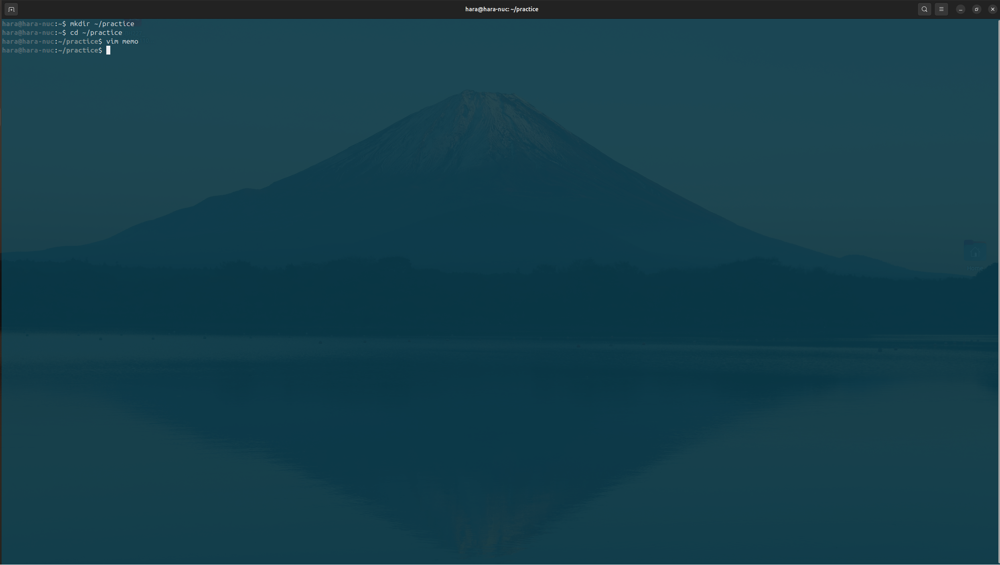
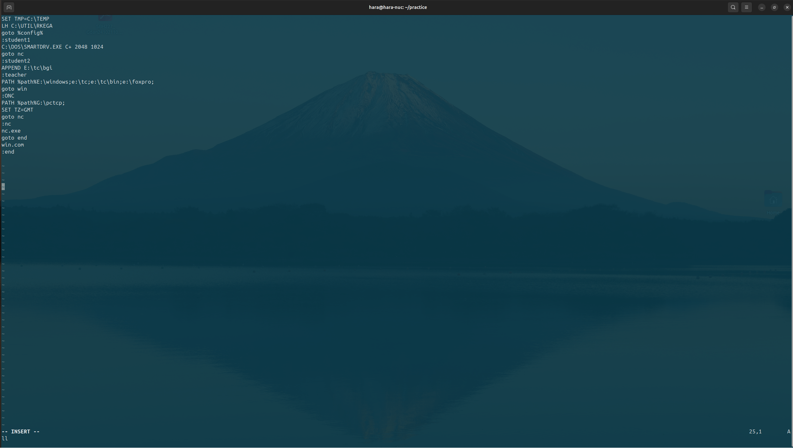
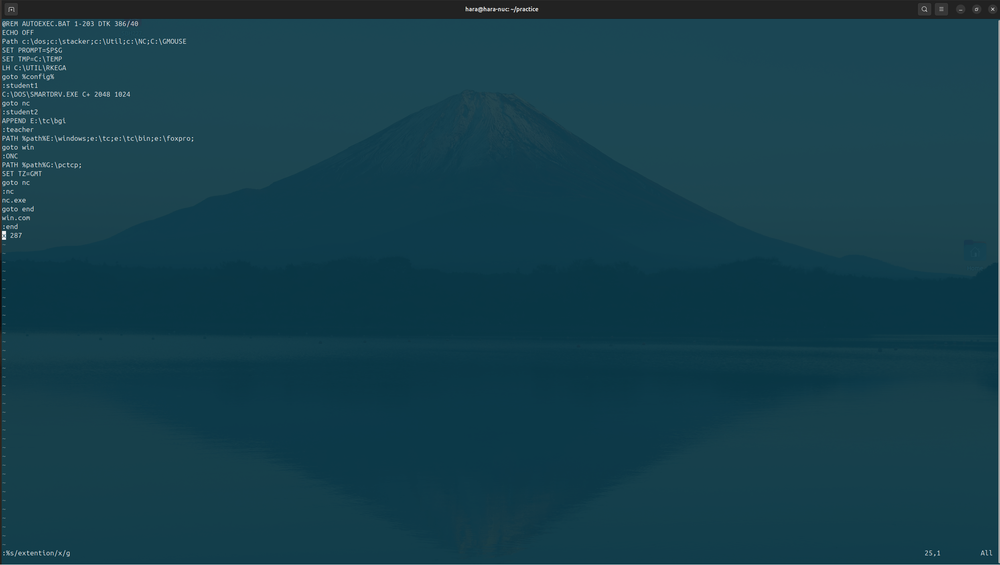
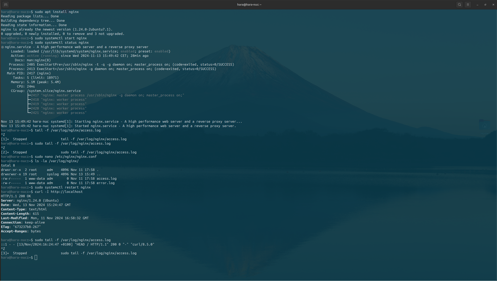
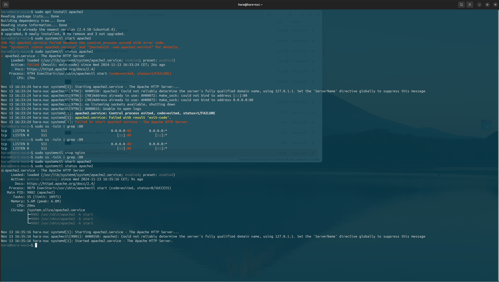
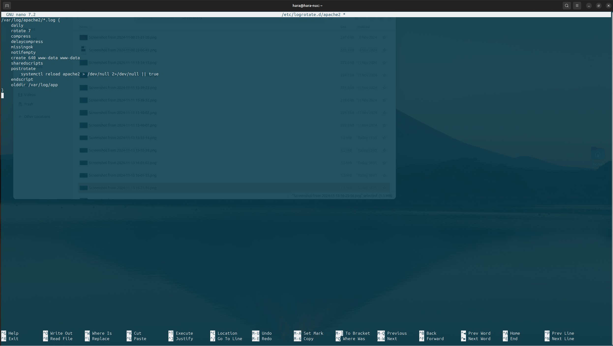
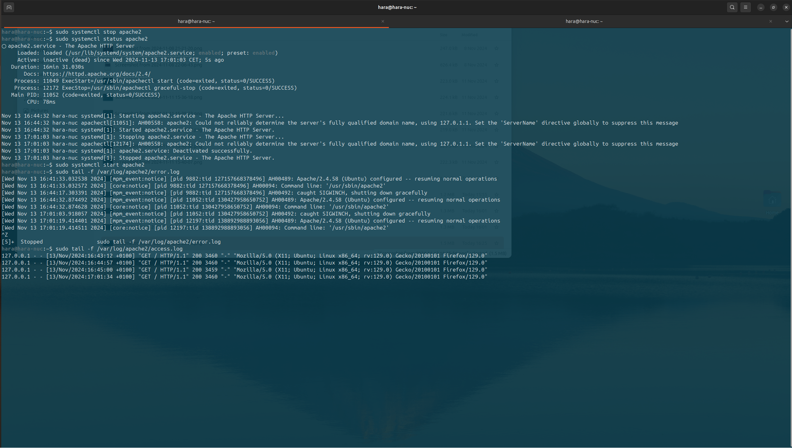

# Отчет по выполнению домашней работы
---
## Задание 1: Создание нового файла с использованием vim

1. **Создание каталога `practice` и переход в него.**
   - Команда:
     ```bash
     mkdir ~/practice
     cd ~/practice
     ```

2. **Создание и редактирование файла `memo` с помощью vim.**
   - Команда:
     ```bash
     vim memo
     ```
   - Ввод текста в режиме вставки.

3. **Сохранение файла и выход из редактора.**
   - Нажаты клавиши:
     ```
     :wq
     ```
   
4. **Скриншот**: 
   

---

## Задание 2: Редактирование существующего файла `memo`

1. **Редактирование строки и замена слов в файле `memo`.**
   - Открытие файла:
     ```bash
     vim ~/practice/memo
     ```
   - Поиск и замена текста:
     - Заменено `DTK` на `1-203 DTK`
     - Заменено `C:\MOUSE` на `C:\GMOUSE`
   
2. **Добавление новой строки и редактирование файла.**
   - Вставка строки `extention 287`, замена на `x`.
   - Удаление последней строки и её восстановление.

3. **Скриншоты**:
   - Начальный файл для редактирования:  
     
   - Отредактированный файл:  
     

---

## Задание 3: Работа с файлом `testcase.c`

SKIP (задание не отредактировано на 13.11)

---

## Задание 4: Установка и работа с логами Nginx и Apache

1. **Установка и настройка Nginx.**
   - Команды:
     ```bash
     sudo apt update
     sudo apt install nginx
     sudo systemctl start nginx
     sudo systemctl enable nginx
     ```
   - Просмотр логов:
   В браузере в адресной строке ввели http://localhost
     ```bash
     sudo tail -f /var/log/nginx/access.log
     sudo tail -f /var/log/nginx/error.log
     ```

    
   
2. **Скриншот**:
   

3. **Установка Apache и работа с логами.**
   - Команды:
     ```bash
     sudo apt install apache2
     sudo systemctl start apache2
     sudo systemctl enable apache2
     ```
   - Логи Apache:
     ```bash
     sudo tail -f /var/log/apache2/access.log
     sudo tail -f /var/log/apache2/error.log
     ```

4. **Настройка logrotate для Apache.**
   - Изменение файла `/var/log/apache2/*.log`.

5. **Скриншоты**:
   - Подключение Apache:  
     
   - Изменение файла `/var/log/apache2/*.log`:  
     
   - Логи Apache:  
     

---

## Вывод
В ходе выполнения работы:
- Было освоено использование редактора `vim` для создания и редактирования файлов.
- Ознакомились с логами Nginx и Apache.
- Изучили процесс настройки утилиты `logrotate`.
